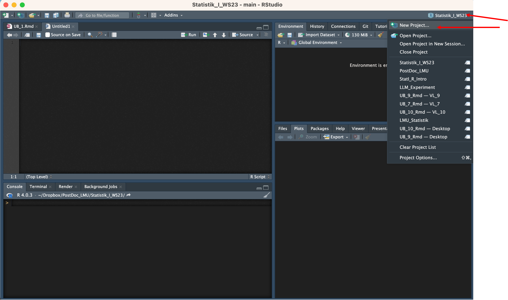

## Session I: 

<div style = "color:red">
1.1. Get to know R \& R studio (basic use, interface)
</div>

<div style = "color:grey">
1.2. Learn about types of variables in R.
    
1.3. Create scripts and save them in R projects (project's folder)

1.4. Get to know TidyTuesday
    
1.5. Read in data sets

</div>

<!-- --- -->
<!-- title: 'Übung 1: Einführung in R' -->
<!-- output: -->
<!--   html_document: -->
<!--     df_print: paged -->
<!-- date: "2023-07-10" -->
<!-- header-includes: \usepackage{xcolor} -->
<!-- --- -->
  
```{r setup, include=FALSE}
library(tinytex)
library(psych)
library(knitr)
knitr::opts_chunk$set(echo = TRUE)
```


<!-- \fontsize{16}{24} -->
<!-- <!-- \fontseries{b} --> 
<!-- \selectfont -->

<!-- \begingroup -->

<!-- \fontfamily{ppl}\fontsize{18}{16}\selectfont -->
<!-- From Reading in Datasets to Data Visualization: -->


<!-- \center R From Scratch. \center -->
<!-- \endgroup -->

<!-- --- -->


<!--  -->


<!-- --- -->

<!-- \begingroup -->
<!-- \fontfamily{ppl}\fontsize{16}{16}\selectfont -->
<!-- \center Agenda:  \center  -->
<!-- \endgroup -->

<!-- \begingroup -->
<!-- \fontfamily{ppl}\fontsize{16}{16}\selectfont -->

<!-- \textcolor{red}{1.1. Get to know R \& R studio (basic use, interface)} -->

<!-- \textcolor{gray}{1.2. Create scripts and save them in R projects (project's folder)} -->

<!-- \textcolor{gray}{1.3. Learn about types of variables in R.}  -->


<!-- \textcolor{gray}{1.4. Get to know TidyTuesday} -->

<!-- \textcolor{gray}{1.5. Read in data sets} -->
<!-- \endgroup -->

---


# What is R? 

R is a powerful and open-source programming language and environment designed specifically for statistical computing and graphics. R has grown to be the tool of choice for statisticians, data scientists, and researchers worldwide.


# What is R Studio 

While not part of R itself, RStudio is a popular integrated development environment (IDE) for R, which provides a more user-friendly interface, debugging tools, and other useful features to make working with R easier and more efficient.

# Lets Download R 

1. Click on this link: \url{https://cran.r-project.org}

The top of the web page provides three links for downloading* R, depending on your operating system: **Windows, Mac, or Linux**. If, for example, you install R on Windows, click the “Download R for Windows” link.


2. Click the “base” link. 

Next, click the first link at the top of the new page. This link should say something like “Download R 3.0.3 for Windows,” except the 3.0.3 will be replaced by the most current version of R. 

The link downloads an installer program, which installs the most up-to-date version of R for your operation system. 

Run this program and step through the installation wizard that appears. 
The wizard will install R into your program files folders and place a shortcut in your Start menu. Note that you’ll need to have all of the appropriate administration privileges to install new software on your machine.

# Install R Studio 


You can download RStudio for free here: \url{https://posit.co/products/open-source/rstudio/}. 

Just click the “Download RStudio” button and follow the simple instructions that follow. 


Once you’ve installed RStudio, you can open it like any other program on your computer—usually by clicking an icon on your desktop.


# Now That we Have R Studio Installed, Lets Get to Know Its Environment 

When you start using R, you'll typically interact with the following:

1. **Source (Script) Pane**:

This is where you'll write and edit your R scripts or R Markdown documents.
Scripts are essentially sequences of R commands that you want to run.
You can run individual lines or chunks of code by highlighting them and pressing Ctrl+Enter (Cmd+Enter on macOS).

2. **Console Pane**:

This is the heart of the R environment. Here, you can type R commands and see them executed in real-time.
Any code executed from the script pane will also run and display results here.
You'll also see messages, errors, and other outputs in this window.


3. **Environment/History Pane**:

Environment Tab: Displays a list of all the variables (including data frames, vectors, values) currently in memory. This is super handy to see what data you've loaded and the variables you've created.
You can click on data frames and matrices in the environment tab to view them in a spreadsheet-like grid.
History Tab: Shows a log of all the commands you've executed. You can re-run any command from here by selecting and pressing Enter.


4. **Files/Plots/Packages/Help Pane**:

- *Files Tab*: Lets you navigate through your computer's file system, much like a file explorer. You can open and save scripts, import data, and manage directories.

- *Plots Tab*: Every time you create a visual (like a graph or chart), it appears here. You can also zoom, export, or navigate between multiple plots.
Packages Tab: Provides a list of all the installed R packages. From here, you can: Load a package into memory using the checkbox next to its name.
Install new packages or update existing ones.

- *Help Tab*: Whenever you need details about a specific function or package, you can use the help tab. Typing ?function_name into the console (e.g., ?mean) will also bring up the help page for that function in this pane.


# Create Your first project in R 

**Why?** 

By using projects, you can ensure that your workspace (i.e., your loaded data, scripts, and other files) remains specific to that project. This approach keeps things clean and avoids potential mix-ups between different tasks or datasets.


**How?** 

Step-by-step guide to create a project in RStudio:

1. **Launch RStudio**: Begin by opening the RStudio application.

  - Go to the Projects Menu: In the top-right corner of RStudio, you'll see a small box (which might say "Project: (None)" if you haven't used projects before). 
  - Click on this box to open a dropdown menu.

2. **Create a New Project**: Select New Project from the dropdown. This will initiate a new dialog box.
    

  
4. **Choose a Project Type**: You'll have three options here:
      - New Directory: Create a brand-new project in a new directory.
      - Existing Directory: Turn an existing directory into a project.
      - Version Control: If you're using Git, SVN, or another version control system, you can clone a repository as a project.

**For this guide, let's select, for simplicity, new directory.**

5. **Select a Directory Type**: You'll be presented with a few options:
    - New Project: A basic project.
    - R Package: If you're developing an R package.
    - Shiny Web Application: If you're making a Shiny app.
Typically, for general data analysis tasks, New Project is the one you'd choose.

6. **Name and Choose Location**:

  - Directory Name: Give your project a name. This will also be the name of the directory/folder that RStudio creates.
  - Create project as a subdirectory of: Browse your file system to choose where you'd like the project directory to be located.
  - Optionally, you can also choose to create a new R script, use packrat (for dependency management), or open in a new session.


7. **Create the Project**: 

Once you've filled everything out, click the Create Project button. RStudio will now make a new directory in your chosen location, and inside that directory, it will create a file with the .Rproj extension. This file holds settings specific to your project.

You're Now in Your New Project: Notice that your working directory has changed (you can confirm with getwd() in the console). Also, any scripts, data, or plots you now create will be associated with this project.


8. **Closing & Opening Projects**: When you close RStudio with an open project, the next time you open that .Rproj file, RStudio will remember your workspace, open scripts, and other settings. It's a great way to pick up where you left off!


# Homework
1. Create your first project 
2. Save it in the correct directory
3. Add a script named "Stat_I_project"
4. Check out this Github repo and choose the topic you are interested in to explore. \url{https://github.com/rfordatascience/tidytuesday}


<!--  -->

<video video loop muted autoplay control width="800" height="600" name="TidyTuesday">
  <source src="Img/TidyTuesday.mov">
</video>

# Create Your first project in R 

**Why?** 

By using projects, you can ensure that your workspace (i.e., your loaded data, scripts, and other files) remains specific to that project. This approach keeps things clean and avoids potential mix-ups between different tasks or datasets.


**How?** 

Step-by-step guide to create a project in RStudio:

1. **Launch RStudio**: Begin by opening the RStudio application.

  - Go to the Projects Menu: In the top-right corner of RStudio, you'll see a small box (which might say "Project: (None)" if you haven't used projects before). 
  - Click on this box to open a dropdown menu.

2. **Create a New Project**: Select New Project from the dropdown. This will initiate a new dialog box.
    

  
4. **Choose a Project Type**: You'll have three options here:
      - New Directory: Create a brand-new project in a new directory.
      - Existing Directory: Turn an existing directory into a project.
      - Version Control: If you're using Git, SVN, or another version control system, you can clone a repository as a project.

**For this guide, let's select New Directory for simplicity.**

5. **Select a Directory Type**: You'll be presented with a few options:
    - New Project: A basic project.
    - R Package: If you're developing an R package.
    - Shiny Web Application: If you're making a Shiny app.
Typically, for general data analysis tasks, New Project is the one you'd choose.

6. **Name and Choose Location**:

  - Directory Name: Give your project a name. This will also be the name of the directory/folder that RStudio creates.
  - Create project as a subdirectory of: Browse your file system to choose where you'd like the project directory to be located.
  - Optionally, you can also choose to create a new R script, use packrat (for dependency management), or open in a new session.


7. **Create the Project**: 

Once you've filled everything out, click the Create Project button. RStudio will now make a new directory in your chosen location, and inside that directory, it will create a file with the .Rproj extension. This file holds settings specific to your project.

You're Now in Your New Project: Notice that your working directory has changed (you can confirm with getwd() in the console). Also, any scripts, data, or plots you now create will be associated with this project.


8. **Closing & Opening Projects**: When you close RStudio with an open project, the next time you open that .Rproj file, RStudio will remember your workspace, open scripts, and other settings. It's a great way to pick up where you left off!

