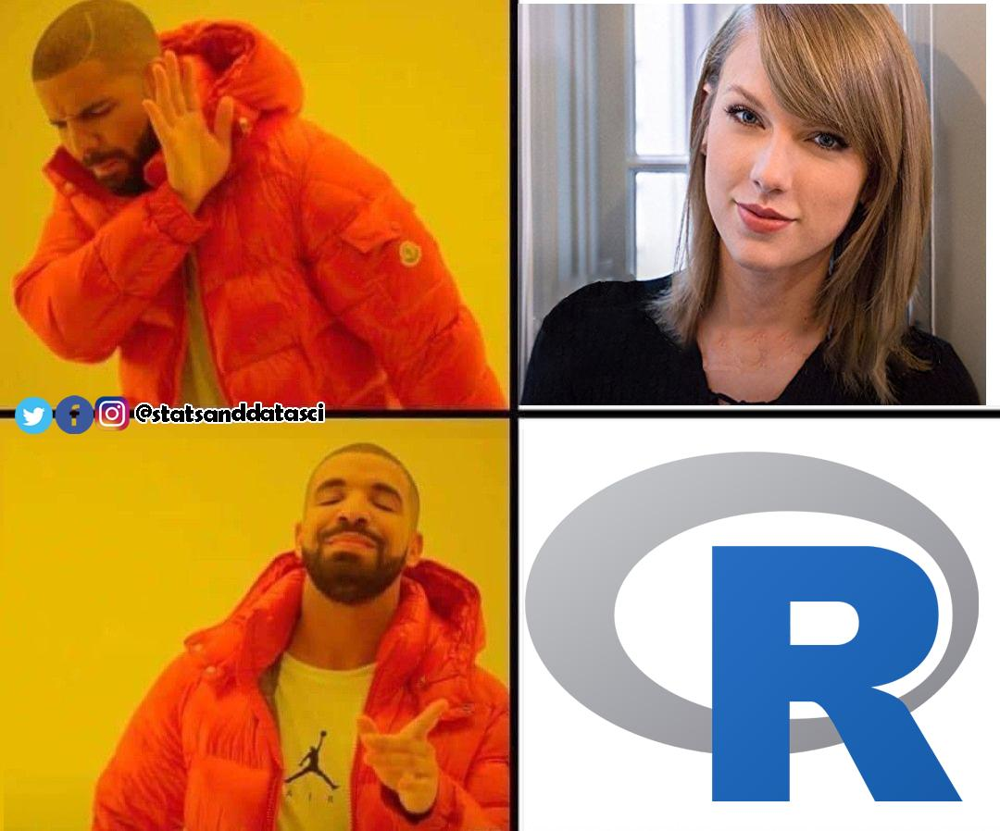
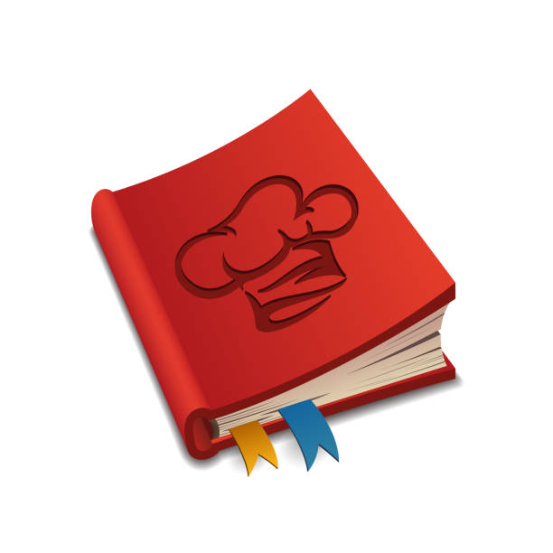

<!-- ## Session I:  -->

<!-- <div style = "color:red"> -->
<!-- 1.1. Get to know R \& R studio (basic use, interface) -->
<!-- </div> -->

<!-- <div style = "color:grey"> -->
<!-- 1.2. Learn about types of variables in R. -->

<!-- 1.3. Create scripts and save them in R projects (project's folder) -->

<!-- 1.4. Get to know TidyTuesday -->

<!-- 1.5. Read in data sets -->

<!-- </div> -->

<!-- --- -->
<!-- title: 'Übung 1: Einführung in R' -->
<!-- output: -->
<!--   html_document: -->
<!--     df_print: paged -->
<!-- date: "2023-07-10" -->
<!-- header-includes: \usepackage{xcolor} -->
<!-- --- -->
  
```{r setup, include=FALSE}
library(tinytex)
library(psych)
library(knitr)
knitr::opts_chunk$set(echo = TRUE)
```


<!-- \fontsize{16}{24} -->
<!-- <!-- \fontseries{b} --> 
<!-- \selectfont -->

<!-- \begingroup -->

<!-- \fontfamily{ppl}\fontsize{18}{16}\selectfont -->
<!-- From Reading in Datasets to Data Visualization: -->


<!-- \center R From Scratch. \center -->
<!-- \endgroup -->

<!-- --- -->


<!--  -->


<!-- --- -->

<!-- \begingroup -->
<!-- \fontfamily{ppl}\fontsize{16}{16}\selectfont -->
<!-- \center Agenda:  \center  -->
<!-- \endgroup -->

<!-- \begingroup -->
<!-- \fontfamily{ppl}\fontsize{16}{16}\selectfont -->

<!-- \textcolor{red}{1.1. Get to know R \& R studio (basic use, interface)} -->

<!-- \textcolor{gray}{1.2. Create scripts and save them in R projects (project's folder)} -->

<!-- \textcolor{gray}{1.3. Learn about types of variables in R.}  -->


<!-- \textcolor{gray}{1.4. Get to know TidyTuesday} -->

<!-- \textcolor{gray}{1.5. Read in data sets} -->
<!-- \endgroup -->

---

<div style = "border: 5px solid;margin: auto;width: 50%;padding: 10px;text-align:center;background:yellow;font-family: curier;font-size:20px"> Englisch </div>

# What is R? 

**R** is a powerful and open-source programming language and environment designed specifically for statistical computing and graphics. R has grown to be the tool of choice for statisticians, data scientists, and researchers worldwide.


# What is R Studio?

While not part of R itself, RStudio is a popular integrated development environment (IDE) for R, which provides a more user-friendly interface, debugging tools, and other useful features to make working with R eadur and more efficient.




# Lets Download R 

1. Click on this [link](https://cran.r-project.org)

The top of the web page provides three links for downloading R, depending on your operating system: **Windows, Mac, or Linux**. If, for example, you install R on Windows, click the “Download R for Windows” link.

Oben auf der Webseite sind drei Links zum Herunterladen von R , abhängig von Ihrem Betriebssystem: Windows, Mac oder Linux. Wenn du zum Beispiel R auf Windows installieren möchten, klicken du auf den Link „Download R for Windows“.


2. Click the “base” link. 

Next, click the first link at the top of the new page. 

This link should say something like “Download R 3.0.3 for Windows” except the 3.0.3 will be replaced by the most current version of R. 

The link downloads an installer program, which installs the most up-to-date version of R for your operation system. 

Run this program and step through the installation wizard that appears. 


The wizard will install R into your program files folders and place a shortcut in your Start menu. 

Note that you’ll need to have all of the appropriate administration privileges to install new software on your machine.


# Install R Studio 

You can download RStudio for free [here](https://posit.co/products/open-source/rstudio/). 

Just click the “Download RStudio” button and follow the simple instructions that follow. 


Once you’ve installed RStudio, you can open it like any other program on your computer—usually by clicking an icon on your desktop.

## Now That we Have R Studio Installed, Lets Get to Know Its Environment 


## When you start using R, you'll typically interact with the following:

1. **Source (Script) Pane**:

This is where you'll write and edit your R scripts or R Markdown documents.


Scripts are essentially sequences of R commands that you want to run.
You can run individual lines or chunks of code by highlighting them and pressing Ctrl+Enter (Cmd+Enter on macOS).


#### ANALOGY
In cooking, a recipe book is your source of instructions for preparing a dish.

Similarly, an R script is like your recipe book for data analysis. It contains a set of instructions (code) that you follow to perform various tasks and analyses.



2. **Console Pane**:

This is the heart of the R environment. Here, you can type R commands and see them executed in real-time.

Any code executed from the script pane will also run and display results here.

You'll also see messages, errors, and other outputs in this window.

#### ANALOGY 

In a kitchen, the chef's workspace is where all the actual cooking and experimentation take place.

In RStudio, the console is your workspace where you can interact with R directly. 

It's where you can run commands, experiment with code, and see immediate results, just like a chef working with ingredients and cooking utensils.


3. **Environment/History Pane**:

Environment Tab: Displays a list of all the variables (including data frames, vectors, values) currently in memory. This is super handy to see what data you've loaded and the variables you've created.

You can click on data frames and matrices in the environment tab to view them in a spreadsheet-like grid.

History Tab: Shows a log of all the commands you've executed. You can re-run any command from here by selecting and pressing Enter.

#### ANALOGY


When cooking, you gather ingredients and use various cooking tools such as pots, pans, and utensils.


In R, the environment consists of variables, data, and functions that you've loaded or created. 

It's where your "ingredients" (data) and "cooking tools" (functions) are stored for use in your analysis.


4. **Files/Plots/Packages/Help Pane**:

- *Files Tab*: Lets you navigate through your computer's file system, much like a file explorer. You can open and save scripts, import data, and manage directories.

- *Plots Tab*: Every time you create a visual (like a graph or chart), it appears here. You can also zoom, export, or navigate between multiple plots.
Packages Tab: Provides a list of all the installed R packages. From here, you can: Load a package into memory using the checkbox next to its name.
Install new packages or update existing ones.

- *Help Tab*: Whenever you need details about a specific function or package, you can use the help tab. Typing ?function_name into the console (e.g., ?mean) will also bring up the help page for that function in this pane.


#### ANALOGY

In cooking, you periodically check the dish's progress to see if it's turning out as expected.


In RStudio, the view tabs (e.g., data viewer, plot viewer) allow you to inspect the intermediate results of your analysis, much like checking on your dish while it's cooking. 

You can visualize data, explore plots, and ensure everything is on track.


----------------------
<div style = "border: 5px solid;margin: auto;width: 50%;padding: 10px;text-align:center;background:yellow;font-family: curier;font-size:20px"> Deutsch </div>


# What is R?

**R** ist eine kostenfreie Software für statistische Datenanalyse und Graphiken. Es beruht auf einer Implementation der Sprache S. Anfänglich wurde R von Ross Ihaka und Robert Gentleman (Univ. Auckland) entwickelt und wird seit Mitte der 90er Jahre von einem Entwickler-Kollektiv (R-Core) betreut.


# What is R Studio?

Obwohl nicht direkt ein Teil von R selbst, ist RStudio eine beliebte integrierte Entwicklungsumgebung (IDE) für R. du bietet eine benutzerfreundlichere Oberfläche, Debugging-Tools und andere nützliche Funktionen, um die Arbeit mit R einfacher und effizienter zu gestalten


# Lets Download R 

1. Oben auf der Webseite sind drei Links zum Herunterladen von R , abhängig von Ihrem Betriebssystem: Windows, Mac oder Linux. Wenn du zum Beispiel R auf Windows installieren möchten, klicken du auf den Link „Download R for Windows“.


2. Klicke zuerst auf den ersten Link ganz oben auf der neuen Seite. 

Der Link wird so etwas wie „R X.0.3 für Windows herunterladen“ anzeigen, aber die X.0.3 wird durch **die neueste Version von R** ersetzt sein.

Wenn du auf den Link klickst, wird ein Installationsprogramm heruntergeladen. Dieses Programm installiert die aktuellste R-Version für dein Betriebssystem.

Starte dieses Programm und folge dem Installationsassistenten. 

R wird in deinem Programmdateien-Ordner installiert werden und ein Verknüpfung im Startmenü erstellen. 

Beachte, dass du alle notwendigen Administrationsrechte benötigst, um neue Software auf deinem Computer zu installieren. 


# Install R Studio 
Du kannst RStudio hier kostenlos herunterladen: [here](https://posit.co/products/open-source/rstudio/).

Klicke einfach auf den „RStudio herunterladen“-Button und folge den einfachen Anweisungen, die danach kommen.


Nachdem du RStudio installiert hast, kannst du es wie jedes andere Programm auf deinem Computer öffnen – normalerweise durch Klicken auf ein Symbol auf deinem Desktop.

## Jetzt, da wir R Studio installiert haben, lass uns seine Umgebung kennenlernen.


Wenn du anfängst, R zu nutzen, wirst du typischerweise mit den folgenden Elementen interagieren:


1. **Quellcode / Skript** Fenster:

Hier schreibst und bearbeitest du deine R-Skripte oder R Markdown-Dokumente.

Skripte sind im Wesentlichen Abfolgen von R-Befehlen, die du ausführen möchtest (analog zum Rezept).

Du kannst einzelne Zeilen oder Code-Blöcke ausführen, indem du du markierst und Ctrl+Enter drückst (Cmd+Enter bei macOS).


#### ANALOGIE
Beim Kochen ist ein Kochbuch Ihre Informationsquelle für die Zubereitung eines Gerichts.

Ähnlich verhält es sich mit einem R-Skript, das wie Ihr Kochbuch für die Datenanalyse ist. Es enthält eine Reihe von Anweisungen (Code), denen du folgen, um verschiedene Aufgaben und Analysen durchzuführen.


2. **Konsole Fenster**:


Dies ist das Herz der R-Umgebung. Hier kannst du R-Befehle eingeben und du in Echtzeit ausführen sehen.

Jeder im Skriptfenster ausgeführte Code wird auch hier ausgeführt und die Ergebnisse werden hier angezeigt.

Du wirst auch Nachrichten, Fehler und andere Ausgaben in diesem Fenster sehen.

#### ANALOGIE

In einer Küche ist der Arbeitsbereich des Kochs der Ort, an dem das eigentliche Kochen und Experimentieren stattfindet.

In RStudio ist die Konsole Ihr Arbeitsbereich, in dem du direkt mit R interagieren können.

Hier können du Befehle ausführen, mit Code experimentieren und sofortige Ergebnisse sehen, genauso wie ein Koch, der mit Zutaten und Kochutensilien arbeitet.


3. **Umgebung/Verlauf Fenster**:
Umgebung Tab: Zeigt eine Liste aller Variablen (einschließlich Datenrahmen, Vektoren, Werte), die gerade im Speicher sind. 

Das ist super praktisch, um zu sehen, welche Daten du geladen hast und welche Variablen du erstellt hast. 

Du kannst auf Datenrahmen und Matrizen im Umgebung-Tab klicken, um du in einem rasterähnlichen Gitter anzusehen.


#### ANALOGIE

Beim Kochen sammeln du Zutaten und verwenden verschiedene Küchenwerkzeuge wie Töpfe, Pfannen und Besteck.

In R besteht die Umgebung aus Variablen, Daten und Funktionen, die du geladen oder erstellt haben.

Hier werden Ihre "Zutaten" (Daten) und "Küchenwerkzeuge" (Funktionen) gespeichert, die du für Ihre Analyse verwenden.


4. **Dateien/Grafiken/Pakete/Hilfe Fenster:**


  - **Dateien Tab**: Ermöglicht dir die Navigation durch dein Computersystem, ähnlich wie ein Datei-Explorer. Du kannst Skripte öffnen und speichern, Daten importieren und Verzeichnisse verwalten.

  - **Grafiken Tab**: Jedes Mal, wenn du ein Visualidurungselement (wie eine Grafik oder ein Diagramm) erstellst, erscheint es hier. Du kannst auch zwischen mehreren Grafiken zoomen, exportieren oder navigieren.
  
  - **Packages Tab**: Zeigt eine Liste aller installierten R-Pakete an. Von hier aus kannst du: Ein Paket in den Speicher laden, indem du das Kästchen neben seinem Namen ankreuzt. Neue Pakete installieren oder bestehende aktualiduren.
  
  - **Hilfe Tab**: Immer wenn du Details über eine bestimmte Funktion oder ein Paket benötigst, kannst du den Hilfe-Tab verwenden. Wenn du ?Funktionsname in die Konsole eingibst (z. B. ?mean), wird auch die Hilfeseite für diese Funktion in diesem Fenster aufgerufen.
  
  
#### ANALOGIE

Beim Kochen überprüfen du regelmäßig den Fortschritt des Gerichts, um zu sehen, ob es sich wie erwartet entwickelt.

In RStudio ermöglichen Ihnen die Ansichtsregisterkarten (z. B. Datenanzeige, Plot-Anzeige), die Zwischenergebnisse Ihrer Analyse zu inspizieren, ähnlich wie beim Überprüfen Ihres Gerichts während des Kochens.

du können Daten visualiduren, Diagramme erkunden und sicherstellen, dass alles wie geplant verläuft.


