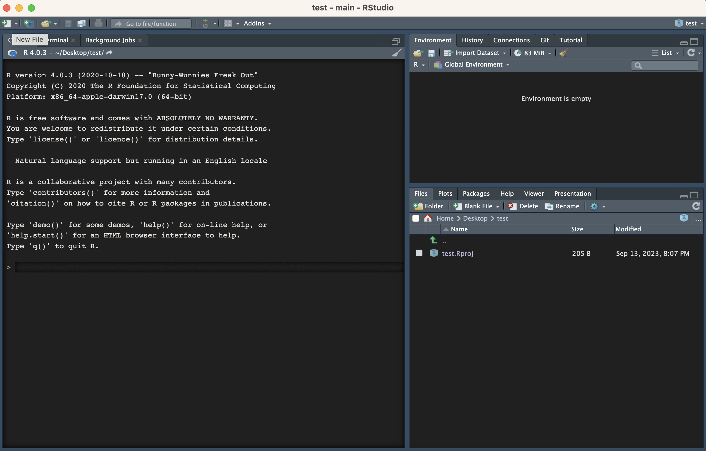
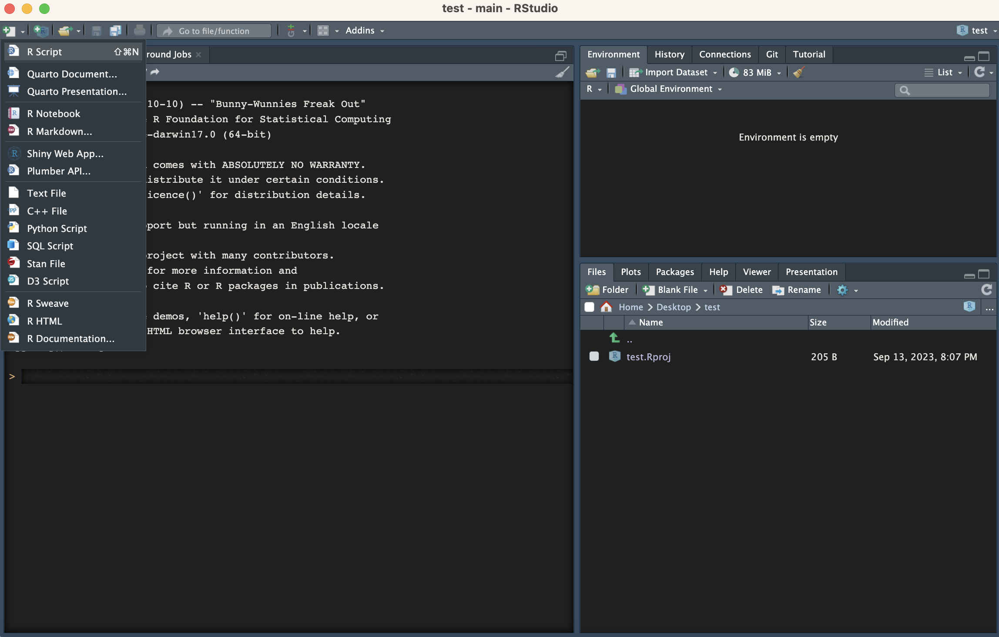
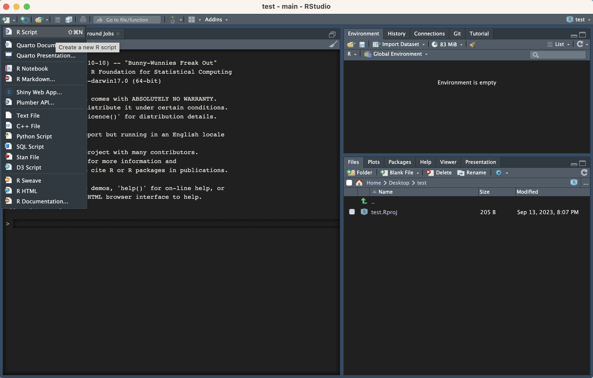
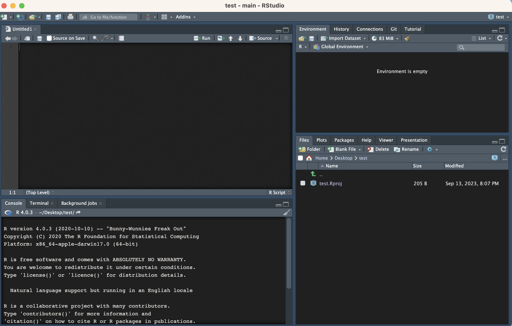
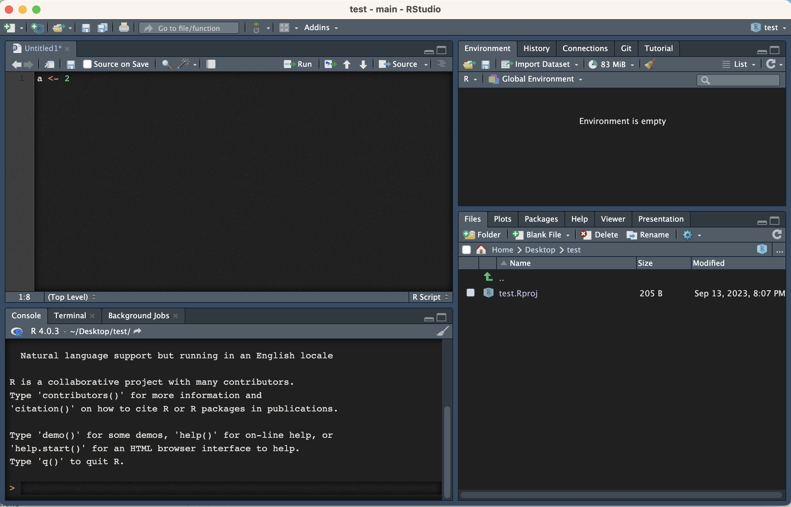
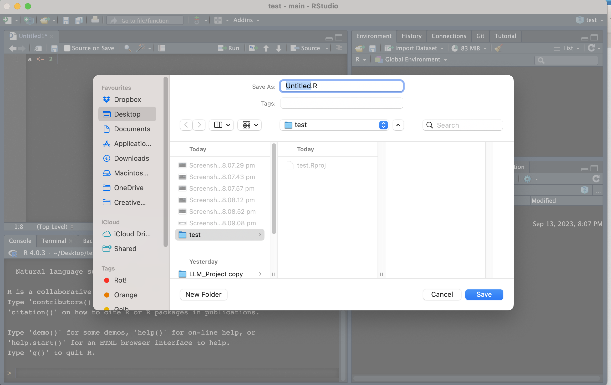
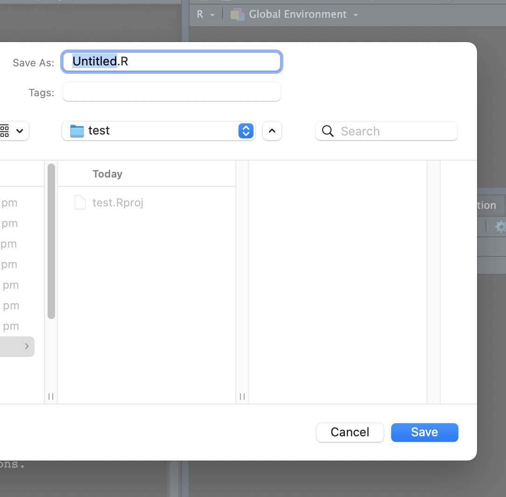

## Session I: 

1.1. Get to know R \& R studio (basic use, interface)

1.2. Learn about types of variables in R.

1.3. Create scripts and save them in R projects (project's folder)

1.4. Get to know TidyTuesday
    
1.5. Read in data sets

----

## Create Your First Project

**Why?** 

By using projects, you can ensure that your workspace (i.e., your loaded data, scripts, and other files) remains specific to that project. This approach keeps things clean and avoids potential mix-ups between different tasks or data sets.

**How?** 

Step-by-step guide to create a project in RStudio:

1. **Launch RStudio**: Begin by opening the RStudio application.

  - Go to the Projects Menu: In the top-right corner of RStudio, you'll see a small box (which might say "Project: (None)" if you haven't used projects before). 
  - Click on this box to open a dropdown menu.

2. **Create a New Project**: Select New Project from the dropdown. This will initiate a new dialog box.
    

  
4. **Choose a Project Type**: You'll have three options here:
      - New Directory: Create a brand-new project in a new directory.
      - Existing Directory: Turn an existing directory into a project.
      - Version Control: If you're using Git, SVN, or another version control system, you can clone a repository as a project.

**For this guide, let's select New Directory for simplicity.**

5. **Select a Directory Type**: You'll be presented with a few options:
    - New Project: A basic project.
    - R Package: If you're developing an R package.
    - Shiny Web Application: If you're making a Shiny app.
Typically, for general data analysis tasks, New Project is the one you'd choose.

6. **Name and Choose Location**:

  - Directory Name: Give your project a name. This will also be the name of the directory/folder that RStudio creates.
  - Create project as a subdirectory of: Browse your file system to choose where you'd like the project directory to be located.
  - Optionally, you can also choose to create a new R script, use packrat (for dependency management), or open in a new session.

7. **Create the Project**: 

Once you've filled everything out, click the Create Project button. RStudio will now make a new directory in your chosen location, and inside that directory, it will create a file with the .Rproj extension. This file holds settings specific to your project.

You're Now in Your New Project: Notice that your working directory has changed (you can confirm with getwd() in the console). Also, any scripts, data, or plots you now create will be associated with this project.

8. **Closing & Opening Projects**: When you close RStudio with an open project, the next time you open that .Rproj file, RStudio will remember your workspace, open scripts, and other settings. It's a great way to pick up where you left off!

---

## Create Scripts Within Your Project
Now lets create our first script and save it. 

1. 

2. 

3.

4. 

5. 

6. 

7. 

Or as a video:

<!--  -->

<video width="520" height="440" controls>
  <source src="img/create_script.mov" type="video/mp4">
</video>

