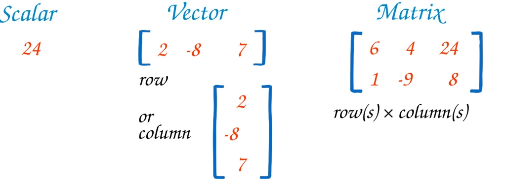

<p style="font-family:monospace;color:blue;font-size:200%"> Objekte - a Quick Recap </p>


Wie wir in unserer letzten Sitzung gesehen und geübt haben, sind Objekte wichtige Bausteine der Datenstrukturen in R. 

In diesem Blog werden wir uns damit beschäftigen, wie wir Objekte, insbesondere Vektoren, mit Funktionen manipulieren und verändern können.

Mithilfe von verschiedenen Funktionen in R können Vektoren auf vielfältige Weise bearbeitet werden, sei es durch **Kombinieren**, **Filtern** oder **Anwenden von mathematischen Operationen**. 

In der folgenden Diskussion werden wir uns mit den spezifischen Funktionen und Techniken befassen, die in R verfügbar sind, um Vektoren effizient zu manipulieren.

## A short recap:



**Skalar**: Ein einfacher Wert.

```{r}
mein_skalar = 42
print(mein_skalar)
```

**Vektor**: Eine eindimensionale Datenstruktur, die mehrere Werte desselben Typs speichern kann.

```{r}
mein_vektor = c(1, 2, 3, 4, 5)
print(mein_vektor)
```

**Matrix**: Eine zweidimensionale Datenstruktur, bei der jedes Element denselben Datentyp hat.

In R wird die Funktion matrix() hauptsächlich verwendet, um Matrizen zu erstellen.

Matrix-Erstellung mit der matrix() Funktion:

Man kann eine Matrix erstellen, indem man die Daten und die Anzahl der Zeilen oder Spalten angibt:

```{r}
meine_matrix = matrix(1:9, nrow=3, ncol=3)
print(meine_matrix)
```


<div style = "border: 1px solid;margin: auto;width: 80%;padding: 10px;text-align:center;background:#F7A8BC;font-family: curier;font-size:18px"> 
Ein **Data Frame** ist eine besondere Art von Liste, bei der jede Spalte ein Vektor sein kann. Im Beispiel unten haben wir einen Data Frame mit drei Personen und ihren jeweiligen Berufen und Altersangaben erstellt.
</div>

<br>Data Frame-Erstellung direkt innerhalb der data.frame() Funktion:

Man kann einen Data Frame direkt innerhalb der Klammern der data.frame() Funktion erstellen, ohne zuerst Vektoren zu definieren. Hierbei werden die Spalten "Name", "Alter" und "Beruf" direkt innerhalb der Funktion definiert, ohne separate Vektoren zu verwenden.

```{r}
# Daten für den DataFrame erstellen
personen = data.frame(
  Name = c("Anna", "Ben", "Clara"),
  Alter = c(25, 30, 29),
  Beruf = c("Ingenieur", "Arzt", "Lehrer")
)

# DataFrame anzeigen
print(personen)
```


Einen Moment... was ist der Unterschied zwischen einer Matrix und einem Data Frame?

Das ist eine berechtigte Frage...

**Data Frame:**
Ein Data Frame in R ähnelt einer Matrix, ist aber **flexibler**, da verschiedene Spalten **unterschiedliche Datentypen** haben können. 

Es ist vergleichbar mit einer Tabelle in einer Datenbank oder einer Excel-Tabelle. 

Ein Data Frame ist eine der **am häufigsten verwendeten Datenstrukturen in R**, insbesondere für Datenanalysen.

```{r}
df <- data.frame(Name = c("Anna", "Ben"), 
                 Alter = c(25, 30))
print(df)
```


