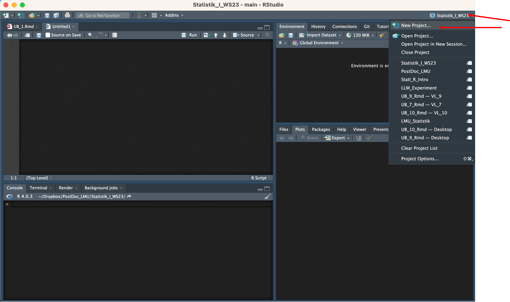

**English**

# Create Your first project in R 

**Why?** 

By using projects, you can ensure that your workspace (i.e., your loaded data, scripts, and other files) remains specific to that project. This approach keeps things clean and avoids potential mix-ups between different tasks or datasets.

**How?** 

Step-by-step guide to create a project in RStudio:

1. **Launch RStudio**: Begin by opening the RStudio application.

  - Go to the Projects Menu: In the top-right corner of RStudio, you'll see a small box (which might say "Project: (None)" if you haven't used projects before). 
  - Click on this box to open a dropdown menu.

2. **Create a New Project**: Select New Project from the dropdown. This will initiate a new dialog box.
    

  
4. **Choose a Project Type**: You'll have three options here:
      - New Directory: Create a brand-new project in a new directory.
      - Existing Directory: Turn an existing directory into a project.
      - Version Control: If you're using Git, SVN, or another version control system, you can clone a repository as a project.

**For this guide, let's select, for simplicity, new directory.**

5. **Select a Directory Type**: You'll be presented with a few options:
    - New Project: A basic project.
    - R Package: If you're developing an R package.
    - Shiny Web Application: If you're making a Shiny app.
Typically, for general data analysis tasks, New Project is the one you'd choose.

6. **Name and Choose Location**:

  - Directory Name: Give your project a name. This will also be the name of the directory/folder that RStudio creates.
  - Create project as a subdirectory of: Browse your file system to choose where you'd like the project directory to be located.
  - Optionally, you can also choose to create a new R script, use packrat (for dependency management), or open in a new session.

7. **Create the Project**: 

Once you've filled everything out, click the Create Project button. RStudio will now make a new directory in your chosen location, and inside that directory, it will create a file with the .Rproj extension. This file holds settings specific to your project.

You're Now in Your New Project: Notice that your working directory has changed (you can confirm with getwd() in the console). Also, any scripts, data, or plots you now create will be associated with this project.

8. **Closing & Opening Projects**: When you close RStudio with an open project, the next time you open that .Rproj file, RStudio will remember your workspace, open scripts, and other settings. It's a great way to pick up where you left off!

# Homework
1. Create your first project 
2. Save it in the correct directory
3. Add a script named "Stat_I_project"
4. Check out this [Github-Repo](https://github.com/rfordatascience/tidytuesday) and choose the topic you are interested in to explore. 

<!--  -->

<video video loop muted autoplay control width="300" height="400" name="TidyTuesday">
  <source src="Img/TidyTuesday.mov">
</video>

# Create Your first project in R 

**Why?** 

By using projects, you can ensure that your workspace (i.e., your loaded data, scripts, and other files) remains specific to that project. This approach keeps things clean and avoids potential mix-ups between different tasks or datasets.

**How?** 

Step-by-step guide to create a project in RStudio:

1. **Launch RStudio**: Begin by opening the RStudio application.

  - Go to the Projects Menu: In the top-right corner of RStudio, you'll see a small box (which might say "Project: (None)" if you haven't used projects before). 
  - Click on this box to open a dropdown menu.

2. **Create a New Project**: Select New Project from the dropdown. This will initiate a new dialog box.
    

  
3. **Choose a Project Type**: You'll have three options here:
      - New Directory: Create a brand-new project in a new directory.
      - Existing Directory: Turn an existing directory into a project.
      - Version Control: If you're using Git, SVN, or another version control system, you can clone a repository as a project.

**For this guide, let's select New Directory for simplicity.**

4. **Select a Directory Type**: You'll be presented with a few options:
    - New Project: A basic project.
    - R Package: If you're developing an R package.
    - Shiny Web Application: If you're making a Shiny app.
Typically, for general data analysis tasks, New Project is the one you'd choose.

5. **Name and Choose Location**:

  - Directory Name: Give your project a name. This will also be the name of the directory/folder that RStudio creates.
  - Create project as a subdirectory of: Browse your file system to choose where you'd like the project directory to be located.
  - Optionally, you can also choose to create a new R script, use packrat (for dependency management), or open in a new session.

6. **Create the Project**: 

Once you've filled everything out, click the Create Project button. RStudio will now make a new directory in your chosen location, and inside that directory, it will create a file with the .Rproj extension. This file holds settings specific to your project.

You're Now in Your New Project: Notice that your working directory has changed (you can confirm with getwd() in the console). Also, any scripts, data, or plots you now create will be associated with this project.

7. **Closing & Opening Projects**: When you close RStudio with an open project, the next time you open that .Rproj file, RStudio will remember your workspace, open scripts, and other settings. It's a great way to pick up where you left off!

---

# **Deutsch**

## Erstelle dein erstes Projekt in R

**Warum?**

Durch die Verwendung von Projekten kannst du sicherstellen, dass dein Arbeitsbereich (d.h. deine geladenen Daten, Skripte und andere Dateien) spezifisch für dieses Projekt bleibt. Dieser Ansatz hält alles übersichtlich und verhindert mögliche Verwechslungen zwischen verschiedenen Aufgaben oder Datensätzen.

**Wie?**

Schritt-für-Schritt Anleitung zur Erstellung eines Projekts in RStudio:

1. **RStudio starten**: Beginne, indem du die RStudio-Anwendung öffnest.

  - Gehe zum Projekte-Menü: In der oberen rechten Ecke von RStudio siehst du ein kleines Feld (welches "Projekt: (Keines)" anzeigen könnte, wenn du zuvor noch keine Projekte verwendet hast).
  
  - Klicke auf dieses Feld, um ein Dropdown-Menü zu öffnen.

2. **Ein neues Projekt erstellen**: Wähle Neues Projekt aus dem Dropdown aus. Dadurch wird ein neues Dialogfeld geöffnet.
Neues Projekt erstellen

3. **Wähle einen Projekttyp**: Du hast hier drei Optionen:

  - Neues Verzeichnis: Erstelle ein brandneues Projekt in einem neuen Verzeichnis.
  
  - **Vorhandenes Verzeichnis**: Verwandle ein bestehendes Verzeichnis in ein Projekt.
  
  - **Versionskontrolle**: Wenn du Git, SVN oder ein anderes Versionskontrollsystem verwendest, kannst du ein Repository als Projekt klonen.
  
  
### Für diesen Leitfaden wählen wir aus Gründen der Einfachheit Neues Verzeichnis.

4. **Wähle einen Verzeichnistyp**: Dir werden einige Optionen angezeigt:

  - **Neues Projekt**: Ein Basisprojekt.
  
  - **R Paket**: Wenn du ein R-Paket entwickelst.
  
  -**Shiny Webanwendung**: Wenn du eine Shiny-App erstellst.Normalerweise würdest du für allgemeine Datenanalyseaufgaben Neues Projekt wählen.

5. **Name und Standort wählen**:

  - Verzeichnisname: Gib deinem Projekt einen Namen. Dies wird auch der Name des von RStudio erstellten Verzeichnisses/Ordners sein.

  - Erstelle das Projekt als Unterordner von: Durchsuche dein Dateisystem, um den gewünschten Standort für das Projektverzeichnis auszuwählen.
  
  - Optional kannst du auch ein neues R-Skript erstellen, Packrat verwenden (zur Abhängigkeitsverwaltung) oder in einer neuen Sitzung öffnen.
  
6. **Das Projekt erstellen**:
Nachdem du alles ausgefüllt hast, klicke auf den Button Projekt erstellen. RStudio wird nun in deinem gewählten Ort ein neues Verzeichnis erstellen und in diesem Verzeichnis eine Datei mit der Erweiterung .Rproj erstellen. Diese Datei enthält projektspezifische Einstellungen.

Du bist jetzt in deinem neuen Projekt: Beachte, dass sich dein Arbeitsverzeichnis geändert hat (du kannst dies mit getwd() in der Konsole bestätigen). Auch alle Skripte, Daten oder Plots, die du jetzt erstellst, werden diesem Projekt zugeordnet.

7. **Projekte schließen & öffnen**: Wenn du RStudio mit einem geöffneten Projekt schließt, wird RStudio bei der nächsten Öffnung dieser .Rproj-Datei deinen Arbeitsbereich, offene Skripte und andere Einstellungen wiederherstellen. Es ist eine großartige Möglichkeit, dort weiterzumachen, wo du aufgehört hast!

# Hausaufgaben
1. Erstelle dein erstes Projekt
2. Speichere es im richtigen Verzeichnis
3. Füge ein Skript mit dem Namen "Stat_I_project" hinzu
4. Sieh dir dieses [Github-Repo](https://github.com/rfordatascience/tidytuesday) an und wähle das Thema aus, das dich interessiert, um es zu erkunden.

<!--  -->

<video video loop muted autoplay control width="300" height="400" name="TidyTuesday">
  <source src="Img/TidyTuesday.mov">
</video>

## Terminology:

**Github repo** 

**English** - A GitHub repo (repository) is like a folder for your project on the website GitHub. It holds all the files, history, and changes related to that project so others can see, use, or help improve it.

**Deutsch** - A GitHub repo (Repository) ist wie ein Ordner für dein Projekt auf der Webseite GitHub. Er beinhaltet alle Dateien, den Verlauf und Änderungen des Projekts, sodass andere es sehen, verwenden oder helfen können, es zu verbessern.

2. TidyTuesday
Tidy Tuesday is a weekly data project aimed at the R community, primarily on Twitter. It provides data enthusiasts with a weekly dataset which they can explore, visualize, and analyze using the R programming language. The initiative encourages participants to share their findings and visualizations on Twitter using the hashtag #TidyTuesday.

The idea is to promote both learning in data visualization and R programming, as well as community engagement. Each week's dataset is diverse, ranging from topics like sports, science, economics, and more. The datasets are often "tidy," meaning they adhere to a specific structure that's optimized for analysis with the tidyverse set of packages in R.

The datasets and challenges are shared via the "rfordatascience" GitHub repository, which is why you often see references to their GitHub repo when discussing Tidy Tuesday.