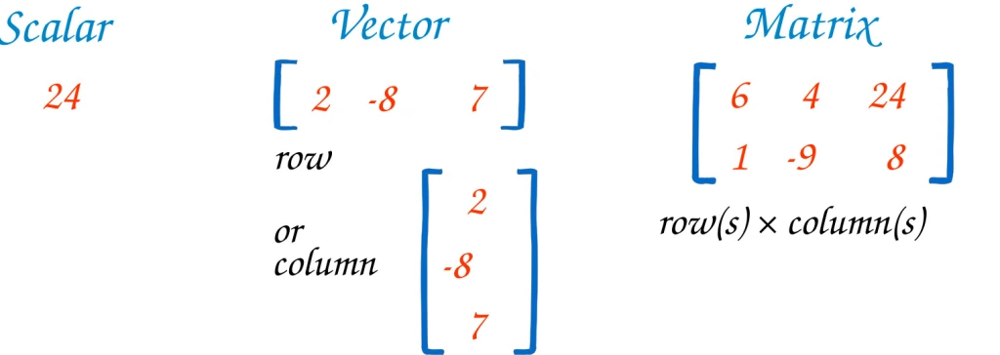
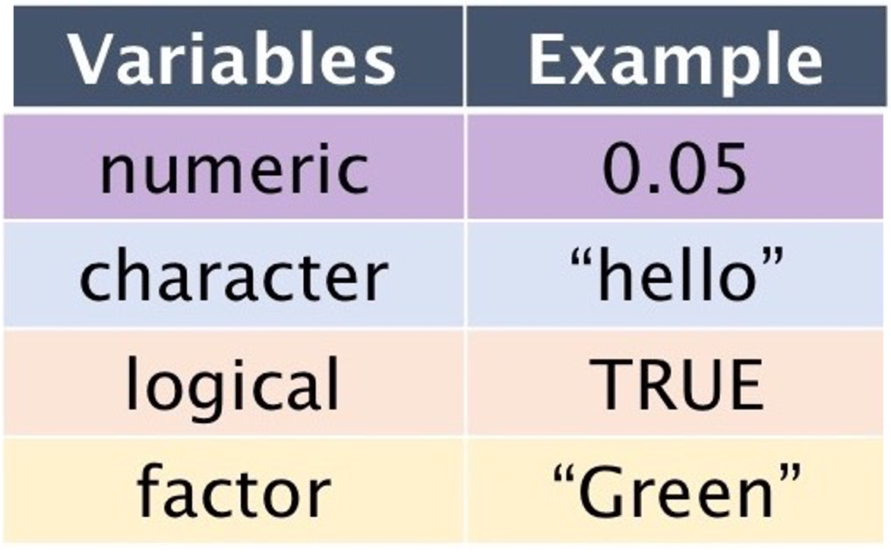

<!-- <div style = "border: 5px solid;margin: auto;width: 50%;padding: 10px;text-align:center;background:yellow;font-family: curier;font-size:20px"> English </div> -->


<!-- ## How R Works?  -->

<!-- In R, there are (essentially) only two things: objects and functions. -->

<!-- **Assignments**: -->
<!-- In R, you use the '=' or '=' symbol for assignments. This symbol is known as the assignment operator. The value on the right gets assigned to the name on the left. -->

<!-- Example: -->

<!-- ```{r} -->
<!-- name = "Tehilla" -->
<!-- ``` -->


<!-- ## Objects -->

<!-- Objects are data. These can be datasets, for example, but also individual numbers, entire models, or even lists of different objects. Objects always have a name and are called by that name. Here is an example:  -->

<!-- ```{r} -->
<!-- tehilla = 154 -->
<!-- tehilla -->
<!-- ``` -->


<!-- Objects also have properties that determine which functions (see more below) can be applied to them. For example, if an object is of type 'numeric,' you can add it to other 'numeric' objects. However, if an object is a 'string,' which is a character string, you cannot add it. Many error messages result from attempting to apply functions to an incompatible data type. -->


<!-- **Variables**: In R, a variable allows you to store data values. Think of it as a named storage that our programs can manipulate. The stored value can be a number, text, a series of numbers, or any other type of data. -->

<!-- Example: -->

<!-- ```{r} -->
<!-- my_variable = 10 -->
<!-- my_variable -->

<!-- age_obj = 35 -->
<!-- age_obj_2 = 1 -->
<!-- I_will_be_X_next_year =  age_obj + age_obj_2 -->
<!-- I_will_be_X_next_year -->
<!-- ``` -->


<!-- **Where to See Stored Variables**: -->
<!-- When you're using R or RStudio, you can view the variables you've defined in a couple of ways: -->

<!--   - In the R console, just type the variable's name and press enter. For example, typing name would output "Tehilla". -->

<!--   - In RStudio, the Environment pane (usually located in the top-right corner) displays a list of all current variables, their type, and their value. -->


<!--  -->


<!-- ## Types of R Objects  -->

<!-- 1. **Vectors**: -->
<!-- A vector is a basic data structure in R that contains elements of the same type. This could be numeric, character, logical, etc. -->

<!-- The c() function is used to concatenate values into a vector. -->

<!-- Example: -->

<!-- ```{r} -->
<!-- numeric_vector = c(1, 2, 3, 4, 5) -->
<!-- character_vector = c("apple", "banana", "cherry") -->
<!-- ``` -->


<!-- In R, variables can hold data of various types. These types are fundamental and determine the kind of operations you can perform on the data. Here's a rundown of the most common data types (or modes) in R: -->

<!--       1.1 Numeric: Represents numbers and can be either integer or double (decimal numbers). -->
<!--       Example: -->

<!-- ```{r} -->
<!-- x = 5    # numeric, specifically an integer -->
<!-- y = 5.5  # numeric, specifically a double -->
<!-- z = x*y  # numeric, specifically a double. a multiplication of x and y -->

<!-- typeof(x) -->
<!-- typeof(z) -->
<!-- ``` -->

<!--         1.2. Character: Represents strings (text).  -->

<!--         Strings in R are enclosed by either single or double quotes. -->

<!--         Example: -->

<!-- ```{r} -->
<!-- name = "John Doe" -->
<!-- name -->

<!-- name_empty = "insert your name" -->
<!-- name_empty -->
<!-- ``` -->

<!--         1.3. Logical: Represents boolean values: TRUE or FALSE.  -->

<!--         Often a result of logical conditions or operations. -->

<!--         Example: -->

<!-- ```{r} -->
<!-- flag = TRUE -->
<!-- flag -->

<!-- is_dog_a_cat =  FALSE -->
<!-- is_dog_a_cat -->


<!-- 3>5 -->
<!-- 3==3 # what would happen if we used a single = sign? -->
<!-- 3<5 -->
<!-- ``` -->


<!--         1.4. Integer: A subtype of numeric.  -->

<!--         It specifically represents integer numbers.  -->

<!--         To specifically define an integer, you can use the L suffix. -->

<!--       Example: -->

<!-- ```{r} -->
<!-- count = 23L -->
<!-- count -->
<!-- ``` -->

<!--       1.5. Factor: Categorical data is often represented as factors in R. -->

<!--       Factors can be ordered (like "Low", "Medium", "High") or unordered (like "Male", "Female").  -->

<!--       While the data might look like characters, factors are stored  -->

<!--       as integers, and a separate lookup table holds the character values. -->


<!--       Example:  -->

<!-- ```{r} -->
<!-- my_gender = "Female" -->
<!-- gender = factor(c("Male", "Female", "Female", "Male")) -->
<!-- gender -->
<!-- ``` -->

<!--      1.6. Lists: A special type that can hold different types of elements, including vectors,  -->

<!--      functions, or even other lists. -->


<!--     Example: -->

<!-- ```{r} -->
<!-- my_list = list(name = "Alice", age = 25, scores = c(85, 90, 92)) -->
<!-- my_list -->

<!-- my_list$name -->
<!-- ``` -->


<!-- ## Lets practice what we have learnt so far.... -->
<!-- 1. create a vector with the following numbers 10, 20, 30, 40, 50 and save it as 'vec' -->
<!-- 2. multiply the 'vec' vector by 2.5 and save the multiplied vector as "mult_vec" -->
<!-- 3. find out of these are equal to vec_check = c(25, 50, 70, 100, 125) -->
<!-- 4. which of the elements in the vector is wrong?  -->
<!-- 5. change the new vector to output only "TRUE". -->
<!-- 7. add another number to the original vector 'vec'. change 'vec_check' to output only "TRUE".  -->


<!--  -->


<!-- # Functions  -->

<!-- Functions alter objects in specific ways.  -->

<!-- A function can be almost anything. For statistics, we mainly need functions that transform data (e.g., mapping strings to specific values, creating new variables, loading datasets, saving datasets, etc.) and functions that perform statistical calculations (e.g., calculating means,  -->

<!-- performing regressions, etc.). -->


<!--  -->

<!-- **Example**:  -->

<!-- Here is an innocent vector... It's about to change its form by being passed into a function.  -->

<!-- ```{r} -->
<!-- # Create a numeric vector -->
<!-- numbers = c(5, 10, 15, 20, 25)  -->

<!-- # The function c() is used very often. It combines elements into a vector. -->
<!-- numbers -->
<!-- ``` -->


<!-- In fact, we will use the "mean" function in R to calculate the average or arithmetic mean of a set of numeric values. It adds up all the numbers in a dataset and then divides that sum by the total count of numbers.  -->

<!-- This provides you with a single value that represents the central tendency or typical value of the data.  -->

<!-- ```{r} -->
<!-- # Calculate the mean -->
<!-- average = mean(numbers) -->

<!-- # Print the result. print is another function... -->
<!-- print(average) -->

<!-- ``` -->


<!-- In this example, the mean function will add up the numbers (5 + 10 + 15 + 20 + 25) and divide the sum by the total count (5 in this case), resulting in an average of 15. -->


<!-- Functions can also generate data and objects. For example, there are functions that create random numbers. -->

<!-- Here are few examples:  -->

<!-- 1. The seq() function generates a sequence between two numbers. -->

<!-- ```{r} -->
<!-- seq(from = 1, to = 10, by = 1) -->
<!-- seq(from = 1, to = 10, length.out = 5) -->
<!-- ``` -->

<!-- 2. The rnorm() function randomly draws 20 values from the normal  -->

<!-- distribution with a mean of 0 and a standard deviation of 1. -->

<!-- ```{r} -->
<!-- rnorm(n = 20, mean = 0, sd = 1)  -->
<!-- ``` -->

<!-- 3. Functions can also generate graphics from objects.  -->

<!-- Creates a histogram from the vector of normally distributed variables. -->

<!-- ```{r} -->
<!-- normally_distributed = rnorm(n = 20, mean = 0, sd = 1) -->
<!-- hist(normally_distributed)  -->
<!-- ``` -->


-----

<div style = "border: 5px solid;margin: auto;width: 50%;padding: 10px;text-align:center;background:yellow;font-family: curier;font-size:20px"> Deutsch </div>

In diesem Blog werden wir uns mit zwei grundlegenden Konzepten befassen, die die Grundlage jeder Programmiersprache bilden: Objekte und Funktionen. 

**Objekte** sind die Behälter, die Informationen speichern und es uns ermöglichen, Daten zu speichern und zu manipulieren, während **Funktionen** die Werkzeuge sind, mit denen wir spezifische Aufgaben effizient ausführen können. 


<p style="font-family:monospace;color:red;font-size:280%"><br><br> Wie Funktioniert R?</p>

In R gibt es im Wesentlichen nur zwei Dinge: 

1. **Objekte**

2. **Funktionen**

<p style="font-family:monospace;color:red;font-size:200%"> Objekte</p>

Objekte sind Daten. Dies können beispielsweise Datensätze sein, aber auch einzelne Zahlen, ganze Modelle oder sogar Listen von verschiedenen Objekten. 

Objekte haben auch Eigenschaften, die bestimmen, welche Funktionen (siehe unten) auf sie angewendet werden können. 

Objekte haben immer einen Namen und werden mit diesem Namen aufgerufen.



<p style="font-family:monospace;color:blue;font-size:200%"> Ein Skalar </p>

Ein Skalar ist in einfachen Worten eine einzelne Zahl oder ein einzelner Wert. In der Mathematik und Programmierung ist ein Skalar ein einzelnes Element, das keine Richtung oder Dimension hat. Zum Beispiel ist die Zahl 5 ein Skalar, da sie einfach eine einzelne Zahl darstellt, ohne eine bestimmte Richtung oder Größe in einem Raum oder einer Datenstruktur zu haben. Skalare werden oft in Berechnungen und Programmierungen verwendet, um einzelne Werte oder Datenpunkte darzustellen.

<div style = "border: .5px solid;margin: auto;width: 80%;padding: 10px;text-align:center;background:#FBF18D;font-family: curier;font-size:16px">*p.s.
In der Programmierung sind Zeichenketten (Strings) Abfolgen von Zeichen, wie Wörter oder Sätze. Um sie von anderen Datentypen wie Variablen oder Zahlen zu unterscheiden, müssen Zeichenketten in Anführungszeichen eingeschlossen sein (i.e., doppelte (" ")), um eine Zeichenkette zu definieren.</div>

```{r}
tehilla = 54
tehilla

age_obj = 35
age_obj_2 = 1
Ich_werde_nächstes_Jahr_X_sein =  age_obj + age_obj_2
print(c("Ich werde, nächstes Jahr,", Ich_werde_nächstes_Jahr_X_sein, "Jahre alt"))
```


<div style = "border: 1px solid;margin: auto;width: 90%;padding: 10px;text-align:left;background:#DBF9FC;font-family: curier;font-size:15px">
Aufgabe: 

1. Set a variable with your name and assign a value. For example: your_name = "Lena". 

2. Create a variable for your current age and assign a value, e.g., your_age = 30

3. Create another variable that represents your age next year. You can achieve this by adding 1 to your current age. For example: your_age_next_year = your_age + 1

4. Output the current and future age using the print() command and the respective variables.

</div>


<p style="font-family:monospace;color:blue;font-size:200%"> <br>Vektoren</p>
    
Ein Vektor ist eine grundlegende Datenstruktur in R, die Elemente des gleichen Typs enthält. Dies kann numerisch, character, logisch usw. sein.
    
Die Funktion c() wird verwendet, um Werte zu einem Vektor zusammenzuführen.

```{r}
# Adding two numeric vectors element-wise
vector1 <- c(1, 2, 3, 4, 5)
vector2 <- c(6, 7, 8, 9, 10)
result_vector <- vector1 + vector2
print(result_vector)
```


<div style = "border: 1px solid;margin: auto;width: 90%;padding: 10px;text-align:left;background:#DBF9FC;font-family: curier;font-size:15px">
Aufgabe: 

1. Create a vector 'your_age_and_friends' that contains the current age values. For example: your_age_and_friends <- c(25, 30, 35, 40).

2. Create another vector 'ones_vector' consisting solely of ones and having the same length as the vector 'your_age_and_friends'. 

3. Add the two vectors 'your_age_and_friends' and 'ones_vector' element-wise to calculate the age values of all friends for next year.

4.Create the vector 'age_of_friends_next_year' to represent the age values of all friends for next year, and save this vector as 'age_of_friends_next_year'.


</div>

<!-- **Variablen**: In R ermöglicht es eine Variable, Datenwerte zu speichern.  -->

<!-- Denken Sie an sie als an einen benannten Speicher, den unsere Programme manipulieren können.  -->

<!-- Der gespeicherte Wert kann eine Zahl, Text, eine Reihe von Zahlen oder jede andere Art von Daten sein. -->

<!-- Beispiel: -->

<!-- ```{r} -->
<!-- meine_variable = 10 -->
<!-- meine_variable -->
<!-- ``` -->


<!-- **Zuweisungen**: In R verwenden Sie das = Symbol für Zuweisungen.  -->

<!-- Dieses Symbol wird als Zuweisungsoperator bezeichnet.  -->

<!-- Der Wert auf der rechten Seite wird dem Namen auf der linken Seite zugewiesen. -->


<!-- Beispiel: -->

<!-- ```{r} -->
<!-- name = "Tehilla" -->

<!-- ``` -->

<!-- **Wo Sie gespeicherte Variablen sehen können**: -->

<!-- Wenn Sie R oder RStudio verwenden, können Sie die von Ihnen definierten Variablen auf verschiedene Arten anzeigen: -->

<!-- In der R-Konsole geben Sie einfach den Namen der Variablen ein und drücken Sie Enter. Wenn Sie beispielsweise 'name' eingeben, wird "Tehilla" ausgegeben. -->

<!-- In RStudio zeigt das Environment-Fenster (normalerweise oben rechts) eine Liste aller aktuellen Variablen, ihres Typs und ihres Werts an. -->


<!--  -->


<p style="font-family:monospace;color:blue;font-size:200%"> <br>Data Arten in R </p>

{width=50%}

    Beispiel:

```{r}
numerischer_vektor = c(1, 2, 3, 4, 5)
character_vektor = c("Apfel", "Banane", "Kirsche")
```

In R können Variablen Daten verschiedener Typen speichern. 

Diese Typen sind grundlegend und bestimmen die Art der Operationen, die auf die Daten angewendet werden können. 

Hier ist eine Übersicht über die häufigsten Datentypen (oder modes) in R:

<p style="font-family:monospace;color:red;font-size:150%"> Numerisch</p>

Stellt Zahlen dar und kann entweder Ganzzahlen oder Dezimalzahlen sein.
  
    Beispiel:
    
```{r}
x = 5    # numerisch, speziell eine Ganzzahl
y = 5.5  # numerisch, speziell eine Dezimalzahl
z = x*y  # numeric, specifically a double. a multiplication of x and y
typeof(z)
```
  
  
<div style = "border: 1px solid;margin: auto;width: 90%;padding: 10px;text-align:left;background:#DBF9FC;font-family: curier;font-size:15px">
Aufgabe: 

1. Create a variable 'your_age' and assign a numerical value that represents your current age, including decimal places to account for months. For example: your_age = 25.5 (25 years and 6 months).

2. Create another variable 'friend_age' and assign a numerical value that represents the age of one of your friends, also including decimal places for months. For example: friend_age = 30.8 (30 years and 9 months).

3. Calculate the product of your age and your friend's age, and assign the result to a variable 'product_of_ages'

4. Use the typeof() function (as shown in the provided code) to check the data type of the variable 'product_of_ages' and determine whether it is a 'double' (which is used in R to represent both floating-point numbers and integers).

</div>


  
<p style="font-family:monospace;color:red;font-size:150%"> <br>Character</p>

Stellt Zeichenketten (Text) dar. 
    
Zeichenketten in R sind entweder von einfachen oder doppelten Anführungszeichen umschlossen.
    
Beispiel:
    
```{r}
name = "John Doe"
name

name_empty = "insert your name"
name_empty
```
    

  
<div style = "border: 1px solid;margin: auto;width: 90%;padding: 10px;text-align:left;background:#DBF9FC;font-family: curier;font-size:15px">
Aufgabe: 

1. Create a variable 'your_name' and assign a value that represents your name. For example: your_name <- "Max Mustermann".

2. Create another variable 'name_empty' and assign a value that indicates a name should be entered, similar to the provided code. For example: name_empty = "Please Insert Your Name"

3. Output the value of the variable 'your_name' to display your name. For example: print(your_name).

</div>


<p style="font-family:monospace;color:red;font-size:150%"> <br>Logisch</p>

Stellt boolesche Werte dar: TRUE oder FALSE. 
    
Oft das Ergebnis logischer Bedingungen oder Operationen.
    
Beispiel:
    
```{r}
flag = TRUE
flag

is_dog_a_cat =  FALSE
is_dog_a_cat

3>4
3==4
3<4
```

<div style = "border: 1px solid;margin: auto;width: 90%;padding: 10px;text-align:left;background:#DBF9FC;font-family: curier;font-size:15px">
Aufgabe: 


1. Create a variable 'zahl1' and assign it the value 8.

2. Create a variable 'zahl2' and assign it the value 4.

3. Compare the two numbers using logical expressions and report the output for each comparison. For example, check:

      3.1. Whether 'zahl1' is greater than 'zahl2' (zahl1 > zahl2) and report the result.
      3.2. Whether 'zahl1' is equal to 'zahl2' (zahl1 == zahl2) and report the result.
      3.3. Whether 'zahl1' is less than 'zahl2' (zahl1 < zahl2) and report the result."

</div>


<p style="font-family:monospace;color:red;font-size:150%"> <br>Faktor</p>

Kategoriale Daten werden oft als Faktoren in R dargestellt. 
    
Faktoren können geordnet sein (wie "Niedrig", "Mittel", "Hoch") oder ungeordnet (wie "Männlich", "Weiblich"). 
    
Obwohl die Daten wie Zeichenketten aussehen können, werden Faktoren als Ganzzahlen gespeichert, und eine separate 
    
<!-- Lookup-Tabelle enthält die Zeichenwerte. -->
  
Beispiel: 
  
```{r}
geschlecht = factor(c("Männlich", "Weiblich", "Weiblich", "Männlich"))

geschlecht

levels(geschlecht)
```

<div style = "border: 1px solid;margin: auto;width: 90%;padding: 10px;text-align:left;background:#DBF9FC;font-family: curier;font-size:15px">
Aufgabe: 

1. Create a vector called 'fruit_colors' that represents the colors of these fruits. Note: You will need the following structure for your 'fruit_colors' vector (Factor(c(fruit_colors))):

Apple: "Red"
Banana: "Yellow"
Strawberry: "Red"
Grapes: "Green"
Orange: "Orange"
Cherry: "Red"
Raspberry: "Red"
Plum: "Purple"
Mango: "Orange"
Lemon: "Yellow"

2. Print the created vector 'fruit_colors'.

3. Use the levels() function on your 'fruit_colors' vector to display the unique color categories or factors in the vector. Name it unique_colour. 

</div>


---

<p style="font-family:monospace;color:blue;font-size:200%"> Matrix </p>

**Definition:**

Eine Matrix ist eine **geordnete Anordnung von Zahlen, Werten oder Elementen in Zeilen und Spalten**. Sie wird oft als rechteckige Tabelle dargestellt. 

Eine Matrix hat zwei Hauptmerkmale:

**Zeilen**: Die horizontalen Reihen in einer Matrix, die normalerweise numerisch oder alphanumerisch nummeriert oder beschriftet sind.

**Spalten**: Die vertikalen Spalten in einer Matrix, die normalerweise numerisch oder alphanumerisch nummeriert oder beschriftet sind.


Die Elemente in einer Matrix können Zahlen, Buchstaben, logische Werte oder andere Datentypen sein. 

Matrizen werden in der linearen Algebra, Statistik und Datenanalyse häufig verwendet, um Daten zu organisieren, zu strukturieren und mathematische Operationen durchzuführen, wie zum Beispiel Multiplikation, Addition und Subtraktion. 

Matrizen bieten eine effiziente Möglichkeit, Daten in einer tabellarischen Form zu verarbeiten und zu analysieren.

#### Beispiel: Erstellen einer Matrix aus Vektoren. 

```{r}
# Erstellen Sie zwei numerische Vektoren
vektor1 <- c(1, 2, 3)
vektor2 <- c(4, 5, 6)

# Kombinieren Sie die Vektoren, um eine Matrix zu erstellen
matrix1 <- cbind(vektor1, vektor2)
print(matrix1)
```


Funktion cbind stehts für "columns bind" oder "Spalten zusammenfügen". Sie wird verwendet, um mehrere Vektoren, Matrizen oder Datenrahmen nach Spalten zu kombinieren oder zu konkatenieren. 

---


<p style="font-family:monospace;color:blue;font-size:200%"> Listen </p>

Ein spezieller Typ, der **verschiedene Arten von Elementen** wie Vektoren, Funktionen oder sogar andere Listen enthalten kann.

Beispiel:

```{r}
meine_liste = list(name = "Alice", alter = 25, punkte = c(85, 90, 92))
meine_liste
```


{width=70%}

