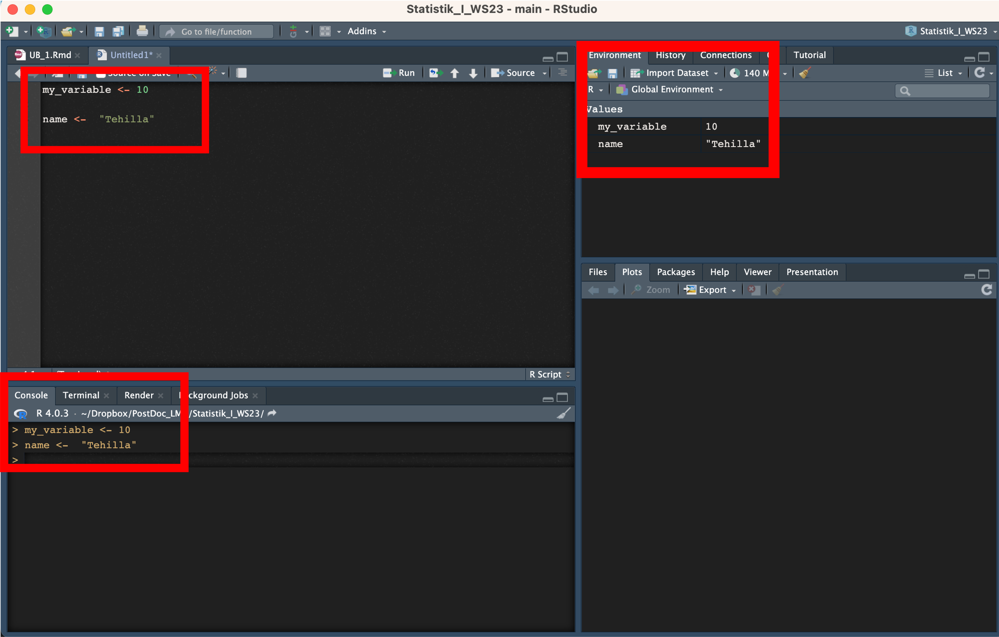
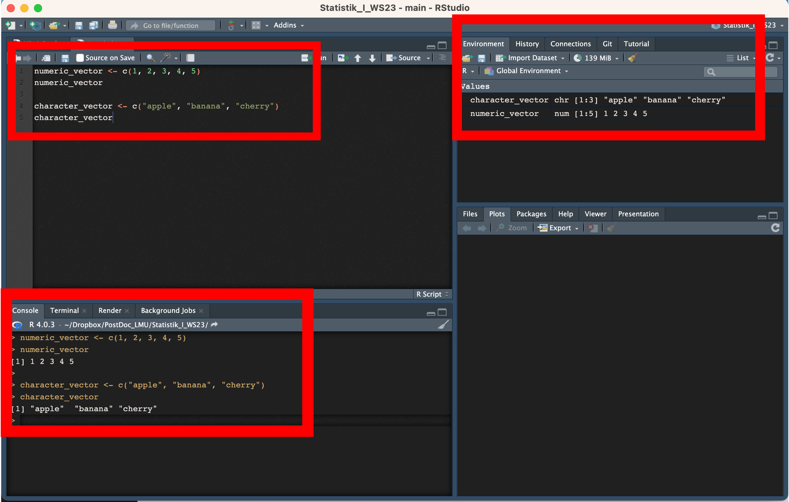
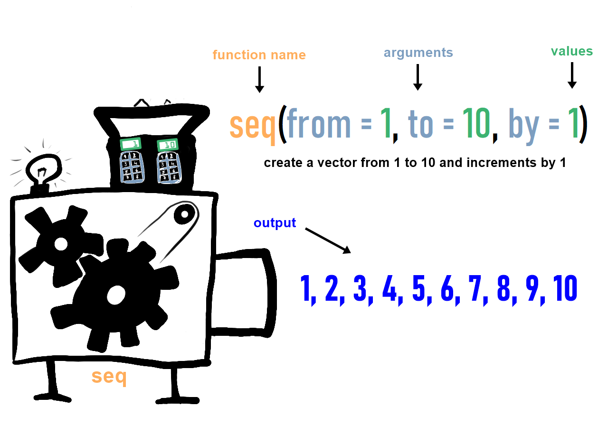

# English


## How R Works? 

In R, there are (essentially) only two things: objects and functions.

## Objects

Objects are data. These can be datasets, for example, but also individual numbers, entire models, or even lists of different objects. Objects always have a name and are called by that name."

```{r}
tehilla <- 54
tehilla
```


Objects also have properties that determine which functions (see more below) can be applied to them. For example, if an object is of type 'numeric,' you can add it to other 'numeric' objects. However, if an object is a 'string,' which is a character string, you cannot add it. Many error messages result from attempting to apply functions to an incompatible data type.

```{r}
age_obj <- 35
age_obj_2 <- 1
I_will_be_X_next_year <-  age_obj + age_obj_2
I_will_be_X_next_year
```


**Variables**: In R, a variable allows you to store data values. Think of it as a named storage that our programs can manipulate. The stored value can be a number, text, a series of numbers, or any other type of data.

Example:

```{r}
my_variable <- 10
my_variable
```


**Assignments**:
In R, you use the <- symbol for assignments. This symbol is known as the assignment operator. The value on the right gets assigned to the name on the left.

Example:

```{r}
name <- "Tehilla"
```


**Where to See Stored Variables**:
When you're using R or RStudio, you can view the variables you've defined in a couple of ways:
  
  - In the R console, just type the variable's name and press enter. For example, typing name would output "Tehilla".
  
  - In RStudio, the Environment pane (usually located in the top-right corner) displays a list of all current variables, their type, and their value.
  
  



#### Types of R Objects 

1. **Vectors**:
A vector is a basic data structure in R that contains elements of the same type. This could be numeric, character, logical, etc.

The c() function is used to concatenate values into a vector.

Example:

```{r}
numeric_vector <- c(1, 2, 3, 4, 5)
character_vector <- c("apple", "banana", "cherry")
```


In R, variables can hold data of various types. These types are fundamental and determine the kind of operations you can perform on the data. Here's a rundown of the most common data types (or modes) in R:
    
      1.1 Numeric: Represents numbers and can be either integer or double (decimal numbers).
      Example:
      
```{r}
x <- 5    # numeric, specifically an integer
y <- 5.5  # numeric, specifically a double
```
        
        1.2. Character: Represents strings (text). Strings in R are enclosed by either single or double quotes.
        Example:
        
```{r}
name <- "John Doe"
name
```

        1.3. Logical: Represents boolean values: TRUE or FALSE. Often a result of logical conditions or operations.
        Example:
        
```{r}
flag <- TRUE
flag
```
        

        1.4. Integer: A subtype of numeric. It specifically represents integer numbers. To specifically define an integer, you can use the L suffix.
      Example:

```{r}
count <- 23L
count
```
      
      1.5. Factor: Categorical data is often represented as factors in R. Factors can be ordered (like "Low", "Medium", "High") or unordered (like "Male", "Female"). While the data might look like characters, factors are stored as integers, and a separate lookup table holds the character values.
      Example: 
      
```{r}
gender <- factor(c("Male", "Female", "Female", "Male"))
gender
```
      
     1.6. Lists: A special type that can hold different types of elements, including vectors, functions, or even other lists.
    Example:
```{r}
my_list <- list(name = "Alice", age = 25, scores = c(85, 90, 92))
my_list
```
    




# Functions 
Functions alter objects in specific ways. A function can be almost anything. For statistics, we mainly need functions that transform data (e.g., mapping strings to specific values, creating new variables, loading datasets, saving datasets, etc.) and functions that perform statistical calculations (e.g., calculating means, performing regressions, etc.).




**Example**: 

Here is an innocent vector... It's about to change its form by being passed into a function. 

```{r}
# Create a numeric vector
numbers <- c(5, 10, 15, 20, 25) 

# The function c() is used very often. It combines elements into a vector.
numbers
```


In fact, we will use the "mean" function in R to calculate the average or arithmetic mean of a set of numeric values. It adds up all the numbers in a dataset and then divides that sum by the total count of numbers. This provides you with a single value that represents the central tendency or typical value of the data. 

```{r}
# Calculate the mean
average <- mean(numbers)

# Print the result
print(average)

```


In this example, the mean function will add up the numbers (5 + 10 + 15 + 20 + 25) and divide the sum by the total count (5 in this case), resulting in an average of 15.


Functions can also generate data and objects. For example, there are functions that create random numbers.

```{r}
rnorm(n = 20, mean = 0, sd = 1) # randomly draws 20 values from the normal distribution with a mean of 0 and SD of 1
```

Functions can also generate graphics from objects.

```{r}
normally_distributed <- rnorm(n = 20, mean = 0, sd = 1)
hist(normally_distributed) # creates a histogram from the vector of normally distributed variables
```


-----

# Deutsch

# Wie R funktioniert

In R gibt es im Wesentlichen nur zwei Dinge: Objekte und Funktionen.

## Objekte

Objekte sind Daten. Dies können beispielsweise Datensätze sein, aber auch einzelne Zahlen, ganze Modelle oder sogar Listen von verschiedenen Objekten. Objekte haben immer einen Namen und werden mit diesem Namen aufgerufen.

```{r}
tehilla <- 54
tehilla
```


Objekte haben auch Eigenschaften, die bestimmen, welche Funktionen (siehe unten) auf sie angewendet werden können. Wenn ein Objekt beispielsweise vom Typ 'numeric' ist, können Sie es zu anderen 'numeric'-Objekten hinzufügen. Wenn ein Objekt jedoch ein 'string' ist, eine Zeichenkette, können Sie es nicht hinzufügen. Viele Fehlermeldungen resultieren aus dem Versuch, Funktionen auf einen unpassenden Datentyp anzuwenden.

```{r}
age_obj <- 35
age_obj_2 <- 1
Ich_werde_nächstes_Jahr_X_sein <-  age_obj + age_obj_2
Ich_werde_nächstes_Jahr_X_sein

```


**Variablen**: In R ermöglicht es eine Variable, Datenwerte zu speichern. Denken Sie an sie als an einen benannten Speicher, den unsere Programme manipulieren können. Der gespeicherte Wert kann eine Zahl, Text, eine Reihe von Zahlen oder jede andere Art von Daten sein.

Beispiel:
```{r}
meine_variable <- 10
meine_variable
```


**Zuweisungen**: In R verwenden Sie das <- Symbol für Zuweisungen. Dieses Symbol wird als Zuweisungsoperator bezeichnet. Der Wert auf der rechten Seite wird dem Namen auf der linken Seite zugewiesen.


Beispiel:

```{r}
name <- "Tehilla"

```

**Wo Sie gespeicherte Variablen sehen können**:
Wenn Sie R oder RStudio verwenden, können Sie die von Ihnen definierten Variablen auf verschiedene Arten anzeigen:

In der R-Konsole geben Sie einfach den Namen der Variablen ein und drücken Sie Enter. Wenn Sie beispielsweise 'name' eingeben, wird "Tehilla" ausgegeben.
In RStudio zeigt das Environment-Fenster (normalerweise oben rechts) eine Liste aller aktuellen Variablen, ihres Typs und ihres Werts an.


#### Arten von R-Objekten

    1. Vektoren:
    Ein Vektor ist eine grundlegende Datenstruktur in R, die Elemente des gleichen Typs enthält. Dies kann numerisch, character, logisch usw. sein.
    Die Funktion c() wird verwendet, um Werte zu einem Vektor zusammenzuführen.

    Beispiel:

```{r}
numerischer_vektor <- c(1, 2, 3, 4, 5)
character_vektor <- c("Apfel", "Banane", "Kirsche")
```

In R können Variablen Daten verschiedener Typen speichern. Diese Typen sind grundlegend und bestimmen die Art der Operationen, die auf die Daten angewendet werden können. Hier ist eine Übersicht über die häufigsten Datentypen (oder modes) in R:

    1.1 Numerisch: Stellt Zahlen dar und kann entweder Ganzzahlen oder Dezimalzahlen sein.
  
    Beispiel:
```{r}
x <- 5    # numerisch, speziell eine Ganzzahl
y <- 5.5  # numerisch, speziell eine Dezimalzahl
```
  
    1.2 Character: Stellt Zeichenketten (Text) dar. Zeichenketten in R sind entweder von einfachen oder doppelten Anführungszeichen umschlossen.
    Beispiel:
    
```{r}
name <- "John Doe"
name
```
    
    
    1.3 Logisch: Stellt boolesche Werte dar: TRUE oder FALSE. Oft das Ergebnis logischer Bedingungen oder Operationen.
    Beispiel:
    

```{r}
flag <- TRUE
flag
```


    1.4 Ganzzahl: Ein Untertyp von numerisch. Es stellt speziell ganze Zahlen dar. Um eine Ganzzahl explizit zu definieren, können Sie das L-Suffix verwenden.
  
    Beispiel:
```{r}
anzahl <- 23L
anzahl
```


    1.5 Faktor: Kategoriale Daten werden oft als Faktoren in R dargestellt. Faktoren können geordnet sein (wie "Niedrig", "Mittel", "Hoch") oder ungeordnet (wie "Männlich", "Weiblich"). Obwohl die Daten wie Zeichenketten aussehen können, werden Faktoren als Ganzzahlen gespeichert, und eine separate Lookup-Tabelle enthält die Zeichenwerte.
  
    Beispiel: 
  
```{r}
geschlecht <- factor(c("Männlich", "Weiblich", "Weiblich", "Männlich"))
geschlecht
```

     1.6 Listen: Ein spezieller Typ, der verschiedene Arten von Elementen wie Vektoren, Funktionen oder sogar andere Listen enthalten kann.

    Beispiel:

```{r}
meine_liste <- list(name = "Alice", alter = 25, punkte = c(85, 90, 92))
meine_liste
```


----

# Functions:

#### The way to maniupulate objects. 


```{r}
vector <- c(1,4,6,8) # die Funktion c() braucht man sehr oft. Sie fügt Elemente␣ ↪zu einem Vektor zusammen
vector
```


## Functions

Funktionen verändern Objekte auf bestimmte Art und Weisen. Eine Funktion kann fast alles sein. Für die Statistik benötigen wir vor allem Funktionen, die Daten transformieren (z.B., Zuordnen von Zeichenketten zu bestimmten Werten, Erstellen neuer Variablen, Laden von Datensätzen, Speichern von Datensätzen usw.) und Funktionen, die statistische Berechnungen durchführen (z.B., Berechnung von Mittelwerten, Durchführung von Regressionen usw.).


**Beispiel**:

Hier ist ein unschuldiger Vektor... Er wird gleich seine Form ändern, indem er an eine Funktion übergeben wird.

```{r}
# Einen numerischen Vektor erstellen
zahlen <- c(5, 10, 15, 20, 25)

# Die Funktion c() wird sehr oft verwendet. Sie fügt Elemente zu einem Vektor zusammen.
zahlen
```

Tatsächlich werden wir in R die Funktion "mean" verwenden, um den Durchschnitt oder arithmetischen Mittelwert einer Menge numerischer Werte zu berechnen. Sie summiert alle Zahlen in einem Datensatz auf und teilt dann diese Summe durch die Gesamtanzahl der Zahlen. Dadurch erhalten Sie einen einzigen Wert, der die zentrale Tendenz oder den typischen Wert der Daten darstellt.

```{r}
# Den Mittelwert berechnen
durchschnitt <- mean(zahlen)

# Das Ergebnis ausgeben
print(durchschnitt)
```

In diesem Beispiel wird die Mittelwert-Funktion die Zahlen (5 + 10 + 15 + 20 + 25) addieren und die Summe durch die Gesamtanzahl (in diesem Fall 5) teilen, was zu einem Durchschnitt von 15 führt.

Funktionen können auch Daten und Objekte generieren. Zum Beispiel gibt es Funktionen, die Zufallszahlen erstellen.

```{r}
rnorm(n = 20, mean = 0, sd = 1) # zieht zufällig 20 Werte aus der Normalverteilung mit einem Mittelwert von 0 und einer Standardabweichung von 1
```

Funktionen können auch Grafiken aus Objekten generieren.

```{r}
normalverteilt <- rnorm(n = 20, mean = 0, sd = 1)
hist(normalverteilt) # erstellt ein Histogramm aus dem Vektor der normalverteilten Variablen
```
