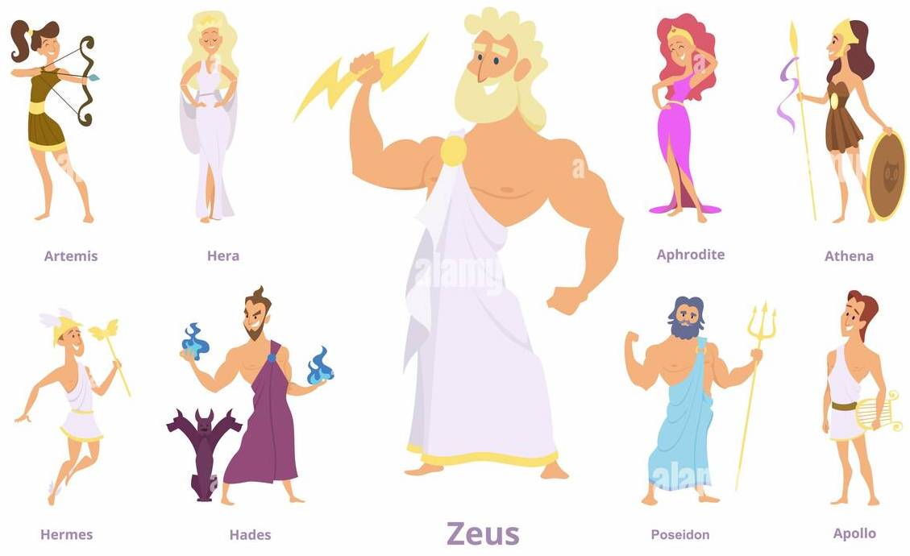
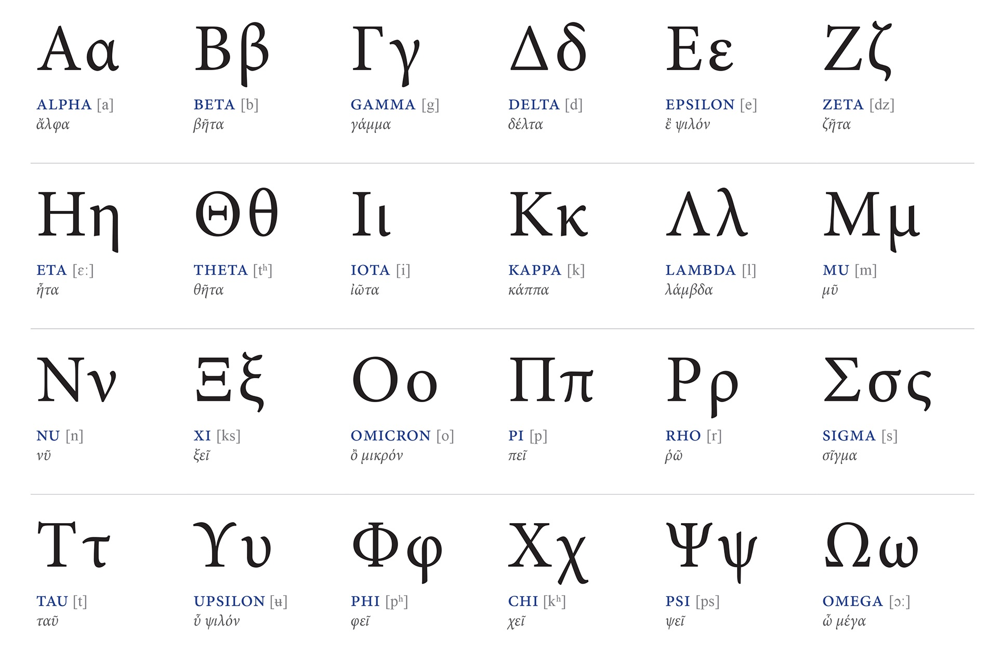

### Standard statistical practices for notation:

In statistical notation, the use of **Greek** letters, Latin letters, and "hat" symbols (also known as caret or circumflex) follows certain conventions and standards. 

These notations are used to represent different types of variables, parameters, and estimators in statistical formulas and equations.

### Lets start with the Greeks:

</img></img>

Greek letters are commonly used to represent **population parameters** OR **random variables**. They often denote fixed, unknown quantities that describe a population. 

Here are some commonly used Greek letters and their meanings in statistics:
- μ (mu): Represents the **population mean**.

- σ (sigma): Represents the **population standard deviation**.

- θ (theta): Represents an unknown **population parameter**.

- π (pi): Represents a **population proportion**.

- ρ (rho): Represents a **population correlation coefficient**.

Greek letters are also used to denote functions, such as the probability density function (pdf) or cumulative distribution function (CDF) of a random variable.

### Now to the Latin ones:

The Latin letters are typically used to represent **sample statistics** OR **observed values**. They are used when working with specific data sets or samples drawn from a population. They are often used when **calculating estimators** or **summarizing sample data**.

Here are some commonly used Latin letters and their meanings in statistics:

- $x$: Represents an **observed value** or a **random variable** from a **sample**.

- $n$: Represents the **sample** size.

- $s$: Represents the **sample** standard deviation.

- $p$: Represents the **sample** proportion.

### What does the hat on top of letters mean?

"Hat" symbol (e.g., $\hat{x}$) is used to indicate an **estimator** or an **estimated value** **based on a sample**. In other words, the "hat" symbol is used to **distinguish estimated values from the true population values or observed sample values**.

It is placed on top of a **Latin letter** to denote that it represents an **estimate rather than an observed value**. 

For example:

- $\hat{y}$ : Represents the **estimated value** of the **dependent variable** in regression analysis.

- $\hat{p}$ : Represents the **estimated proportion** based on a sample.

- $\hat{\beta}$ : Represents the **estimated slope coefficient** in regression analysis.

---

Mathematicians often use set notation to denote all values that can be taken by a variable or a range of values. The notation typically involves curly braces { } and a condition or rule specifying the characteristics of the values. Here are a few common notations:

Set Builder Notation:

- {x | condition} denotes a set of values "x" that satisfy the specified condition. For 
example, {x | x > 0} represents the set of all positive real numbers.
Interval Notation:

- (a, b) represents an open interval that includes all real numbers greater than "a" and less than "b". For example, (0, 1) represents the interval between 0 and 1 (excluding the endpoints).

- [a, b] represents a closed interval that includes all real numbers greater than or equal to "a" and less than or equal to "b". For example, [0, 1] represents the interval including both 0 and 1.

- Enumeration Notation:
{x₁, x₂, x₃, ...} denotes a set of specific values "x₁, x₂, x₃, ..." where the ellipsis (...) indicates that the sequence continues indefinitely.

- i ∈ {1, 2, 3, ..., n}:
This notation indicates that the index "i" belongs to the set of values {1, 2, 3, ..., n}. 

- The ellipsis (...) represents a continuation of the sequence until "n". For example, if you have a dataset with 100 observations, the notation would be:
i ∈ {1, 2, 3, ..., 100}.
