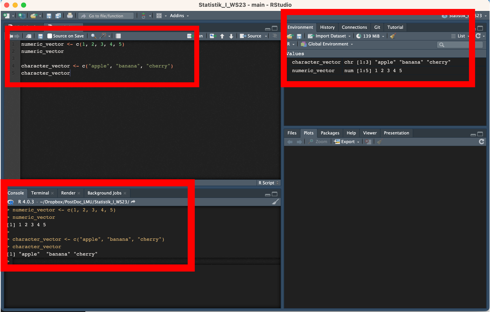

## Session I: 

<div style = "color:grey">
1.1. Get to know R \& R studio (basic use, interface)
</div>

<div style = "color:red">
1.2. Learn about types of variables in R.
</div>

<div style="color:grey">
1.3. Create scripts and save them in R projects (project's folder)

1.4. Get to know TidyTuesday
    
1.5. Read in data sets

</div>


----


## Understanding the basic concepts in R (and in programming in general)

1. **Variables**: In R, a variable allows you to store data values. Think of it as a named storage that our programs can manipulate. The stored value can be a number, text, a series of numbers, or any other type of data.

Example:

```{r}
my_variable <- 10
my_variable
```


2.**Name Assignments**:
In R, you use the <- symbol for assignments. This symbol is known as the assignment operator. The value on the right gets assigned to the name on the left.

Example:

```{r}
name <- "Tehilla"
```

3. **Where to See Stored Variables**:
When you're using R or RStudio, you can view the variables you've defined in a couple of ways:
  
  - In the R console, just type the variable's name and press enter. For example, typing name would output "Tehilla".
  
  - In RStudio, the Environment pane (usually located in the top-right corner) displays a list of all current variables, their type, and their value.
  
  
[Where to See Stored Variables](img/R_Interface_3.png)


4. **Vectors**:
A vector is a basic data structure in R that contains elements of the same type. This could be numeric, character, logical, etc.

The c() function is used to concatenate values into a vector.

Example:

```{r}
numeric_vector <- c(1, 2, 3, 4, 5)
character_vector <- c("apple", "banana", "cherry")
```


    4.1. Types of Variables:
    In R, variables can hold data of various types. These types are fundamental and determine the kind of operations you can perform on the data. Here's a rundown of the most common data types (or modes) in R:
    
      4.1.1 1. Numeric: Represents numbers and can be either integer or double (decimal numbers).
      Example:
      
```{r}
x <- 5    # numeric, specifically an integer
y <- 5.5  # numeric, specifically a double
```
        
        4.1.2. Character: Represents strings (text). Strings in R are enclosed by either single or double quotes.
        Example:
        
```{r}
name <- "John Doe"
name
```

        4.1.3. 3. Logical: Represents boolean values: TRUE or FALSE. Often a result of logical conditions or operations.
        Example:
        
```{r}
flag <- TRUE
flag
```
        

      4.1.4. Integer: A subtype of numeric. It specifically represents integer numbers. To specifically define an integer, you can use the L suffix.
      Example:

```{r}
count <- 23L
count
```
      
      4.1.5. Factor: Categorical data is often represented as factors in R. Factors can be ordered (like "Low", "Medium", "High") or unordered (like "Male", "Female"). While the data might look like characters, factors are stored as integers, and a separate lookup table holds the character values.
      Example: 
      
```{r}
gender <- factor(c("Male", "Female", "Female", "Male"))
gender
```
      
    4.1.6. Lists: A special type that can hold different types of elements, including vectors, functions, or even other lists.
    Example:
```{r}
my_list <- list(name = "Alice", age = 25, scores = c(85, 90, 92))
my_list
```
    



