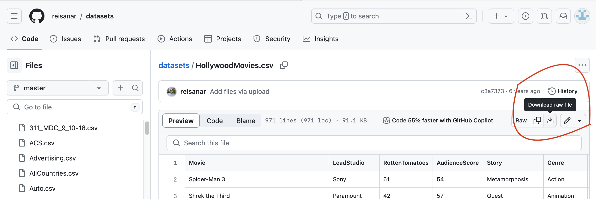

In this blog we will be focusing on two fundamental concepts that form the backbone of statistical analysis: **Descriptive Statistics** and **Inferential Statistics**. 

These two serve distinct purposes in the world of data.


# Descriptive statistics 

Descriptive statistics involves summarizing and organizing data so it can be easily understood. 

Essentially, it's about describing what's observed in the dataset.

These statistics describe the basic features of a dataset, providing simple summaries about the sample and the measures. 


# Inferential Statistics

Inferential statistics involves using a sample of data to make inferences or predictions about a larger population. 

It goes beyond merely describing the sample data to make generalizations about the population from which the sample was drawn.

<div style = "border: 5px solid;margin: auto;width: 90%;padding: 10px;text-align:center;background:yellow;font-family: curier;font-size:20px">
In summary, while descriptive statistics are about summarizing and describing the characteristics of a dataset, inferential statistics uses that data to make predictions, decisions, and inferences about a larger population or future trends
</div>


### lets get our hands dirty....

In our upcoming analysis, we will focus on a meticulously curated dataset of the best-selling movies released between years 2007 and 2013. 

## Get to know your dataset...

**Step 1**: Loading the Dataset

To start, we need to load our dataset into R. 

We will use a real dataset HollywoodMovies.csv (.csv is ...), which includes movie names, budgets, earnings, and country of origin for movies released between the specified years 2007-2013.

# How to call in a dataset in R ?

[link to the Github Repo](https://github.com/reisanar/datasets/blob/master/HollywoodMovies.csv)

1. click on the download button to download this dataset 

</img>


2. Whats in this dataset? Lets call it in.... we use the function read.csv(), which "Reads a file in table format and creates a data frame from it, with cases corresponding to lines and variables to fields in the file."

```{r}
movies <- read.csv("/Users/tmechera/Dropbox/PostDoc_LMU/Teaching/LMU_Statistik_Website/HollywoodMovies.csv")
```


Columns of the Dataset:

**Movie**: The title of the movie. This is the primary identifier for each entry in our dataset.

**LeadStudio**: The production studio responsible for the movie. This helps in analyzing studio-wise performance and trends in the industry.


**RottenTomatoes**: The Rotten Tomatoes score for each movie, representing the percentage of positive reviews from critics. It's a crucial metric for understanding critical reception.


**AudienceScore**: This score reflects the average rating given by the audience, usually on a scale of 1 to 100. It offers a direct insight into viewer preferences and acceptance.

**Story**: A brief description or category of the movie's storyline, which can be used to analyze the popularity of different types of stories.


**Genre**: The genre(s) of the movie. This is important for understanding genre-specific trends and preferences.


**TheatersOpenWeek**: The number of theaters in which the movie was released during its opening week. This indicates the scale of its initial release.


**OpeningWeekend**: The box office collection of the movie during its opening weekend. 
A critical metric for gauging initial audience interest and marketing effectiveness.


**BOAvgOpenWeekend**: Average box office earnings per theater during the opening weekend. This provides a more nuanced view of the movie's initial success.

**DomesticGross**: Total box office collection within the movie's country of origin.


**ForeignGross**: Total box office collection in international markets.


**WorldGross**: Combined global box office collections, a key indicator of a movie's worldwide success.


**Budget**: The estimated production and marketing budget of the movie. This helps in evaluating the financial planning behind the movie.


**Profitability**: An index or calculation based on the movie's earnings versus its budget, offering a direct measure of its financial success.


**OpenProfit**: Profitability during the opening weekend, providing an early indicator of the movie's commercial performance.

**Year**: The year of the movie's release, crucial for analyzing trends over time.


### We will start with the descriptive statistics. 


## Statistical Terms Definitions

1. **Mean:** 
   - **Definition:** The mean, often referred to as the average, is a measure of central tendency. It is calculated by adding up all the values in a dataset and then dividing by the number of values. 
   - **Formula:** If you have a set of values `X = {x1, x2, ..., xn}`, the mean (μ) is calculated as `μ = (Σxi) / n`, where `Σ` denotes summation and `n` is the number of values in the dataset.

2. **Median:** 
   - **Definition:** The median is the middle value in a dataset when the values are arranged in ascending or descending order. If there's an odd number of observations, the median is the middle number. If there's an even number of observations, the median is the average of the two middle numbers.
   - **Calculation:** For a dataset `X` sorted in ascending order, if `n` is odd, the median is the value at position `(n+1)/2`. If `n` is even, the median is the average of the values at positions `n/2` and `n/2 + 1`.

3. **Mode:**
   - **Definition:** The mode is the value that appears most frequently in a dataset. A dataset can have one mode (unimodal), more than one mode (bimodal or multimodal), or no mode at all.
   - **Identification:** In a dataset `X`, the mode is the value(s) that occurs with the highest frequency. Unlike mean and median, the mode can be used with nominal (categorical) data.

4. **Relative Frequency:**
   - **Definition:** Relative frequency is a measure of the number of times a certain value or category appears in a dataset relative to the total number of values or observations. It is often expressed as a fraction or a percentage.
   - **Calculation:** For a value `x` in a dataset, the relative frequency is calculated as `f/n`, where `f` is the frequency of `x` (the number of times `x` appears in the dataset) and `n` is the total number of observations in the dataset.


```{r}
#install.packages("modeest")
library(modeest)  # for mode calculation
# Calculate Mean
mean_budget <- mean(movies$Budget, na.rm = TRUE)

# Calculate Median
median_budget <- median(movies$Budget, na.rm = TRUE)

# Calculate Mode (using modeest package)
mode_budget <- mfv(movies$Budget, na_rm = TRUE)

# Display the results
print(paste("Mean Budget:", mean_budget))
print(paste("Median Budget:", median_budget))
print(paste("Mode Budget:", mode_budget))
```

We can additionally explore the frequencies within our data. This approach offers another method to characterize our dataset and its variables.

### Absolute Frequency

1. **Definition:** 

   - Absolute frequency refers to the count of the number of times a particular value or category occurs in a dataset. 

It's a simple tally of occurrences without any normalization or comparison to the total dataset size.

2. **Example:**  

   - If you have a dataset of movie genres and there are 30 action movies, the absolute frequency of action movies is 30.


### Relative Frequency

1. **Definition:** 
    - Relative frequency is the proportion or percentage of times a value or category appears in a dataset relative to the total number of observations. It's calculated by dividing the absolute frequency of a category by the total number of data points.

2. **Example:** 
  - If you have a dataset of movie genres with a total of 100 movies, and 30 of them are action movies, the relative frequency of action movies is calculated as `30 / 100 = 0.3` or 30%.


```{r}
# Create a table of relative frequencies for a categorical variable like Genre
freq_genre <- table(movies$Genre)
relative_freq_genre = prop.table(freq_genre)


print("Relative Frequency of Genres:")
print(round(relative_freq_genre, digit = 2))
```


```{r setup, include=FALSE}
knitr::opts_chunk$set(echo = FALSE)
```

Distill is a publication format for scientific and technical writing, native to the web. 

Learn more about using Distill for R Markdown at <https://rstudio.github.io/distill>.


