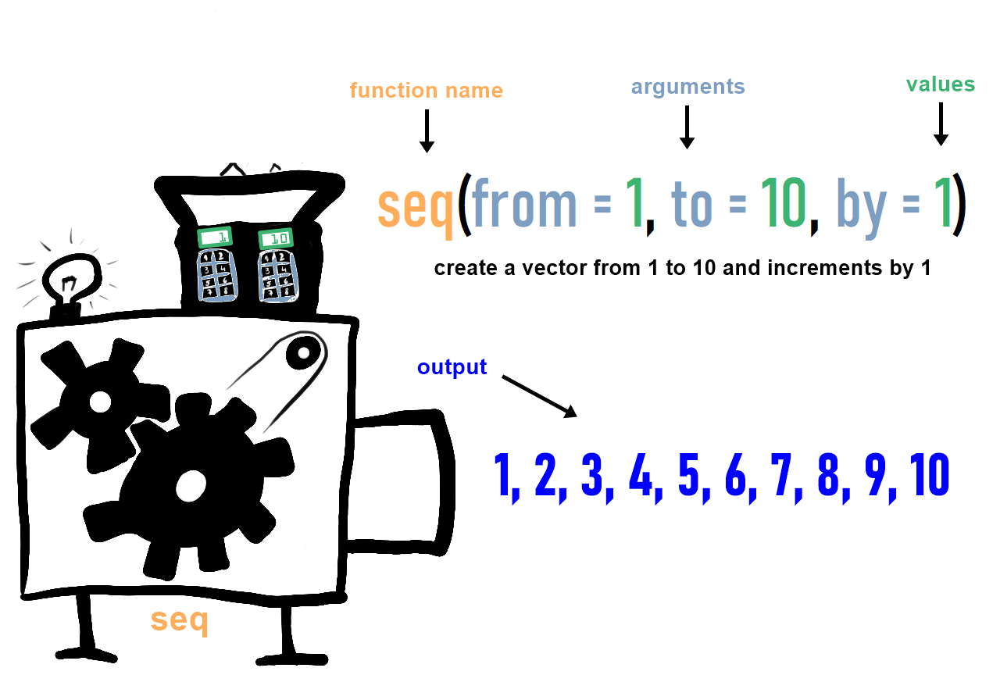

In diesem Blog werden wir uns damit beschäftigen, wie wir Objekte, insbesondere Vektoren, mit Funktionen manipulieren und verändern können.

Mithilfe von verschiedenen Funktionen in R können Vektoren auf vielfältige Weise bearbeitet werden, sei es durch **Kombinieren**, **Filtern** oder **Anwenden von mathematischen Operationen**. 

In der folgenden Diskussion werden wir uns mit den spezifischen Funktionen und Techniken befassen, die in R verfügbar sind, um Vektoren effizient zu manipulieren.

<p style="font-family:monospace;color:blue;font-size:200%"> Funktionen </p>

- Funktionen verändern Objekte auf bestimmte Art und Weisen. 

- Eine Funktion kann fast alles sein. 

- Wenn ein Objekt beispielsweise vom Typ 'numeric' ist, kannst du es zu anderen 'numeric'-Objekten hinzufügen. 

- Wenn ein Objekt jedoch ein 'string' ist, eine Zeichenkette, kannst du es nicht hinzufügen. 

- Viele Fehlermeldungen resultieren aus dem Versuch, Funktionen auf einen unpassenden Datentyp anzuwenden.


Für die Statistik benötigen wir vor allem Funktionen, die Daten transformieren (z.B., Zuordnen von Zeichenketten zu bestimmten Werten, Erstellen neuer Variablen, Laden von Datensätzen, Speichern von Datensätzen usw.) und Funktionen, die statistische Berechnungen durchführen (z.B., Berechnung von Mittelwerten, Durchführung von Regressionen usw.).

<!--  -->

<p style="font-family:monospace;color:pink;font-size:120%"> Hier ist ein Beispiel dafür, wie Funktionen die Form und die Struktur Ihrer Daten ändern können:</p>

Hier ist eine Vektor. er wird gleich seine Form ändern, indem er an eine Funktion übergeben wird.

```{r}
# Einen numerischen Vektor erstellen
zahlen = c(5, 10, 15, 20, 25)

# Die Funktion c() wird sehr oft verwendet. Sie fügt Elemente zu einem Vektor zusammen.
zahlen
```

Wir werden in R die Funktion "mean" verwenden, um den Durchschnitt oder arithmetischen Mittelwert einer Menge numerischer Werte zu berechnen. 

Sie summiert alle Zahlen in einem Datensatz auf und teilt dann diese Summe durch die Gesamtanzahl der Zahlen. 

Dadurch erhalten Sie einen einzigen Wert, der die zentrale Tendenz oder den typischen Wert der Daten darstellt.

```{r}
# Den Mittelwert berechnen
durchschnitt = mean(zahlen)

# Das Ergebnis ausgeben
print(durchschnitt)
```

In diesem Beispiel wird die Mittelwert-Funktion die Zahlen (5 + 10 + 15 + 20 + 25) addieren und die Summe durch die Gesamtanzahl (in diesem Fall 5) teilen, was zu einem Durchschnitt von 15 führt.

----

Oben haben wir gesehen, wie man die eingebaute Funktion mean() in R verwendet. 

Wenn wir jedoch unsere eigene Funktion erstellen möchten, die genau dasselbe tut, müssen wir die folgenden Schritte ausführen:


Zuerst müssen wir eine Funktion definieren, indem wir function() verwenden, gefolgt von den Argumenten, die die Funktion akzeptiert. 

In unserem Fall erwartet die Funktion einen Vektor als Argument. 

Dann schreiben wir den Code, der innerhalb der Funktion ausgeführt wird, um den Durchschnitt zu berechnen. 

Schließlich geben wir das Ergebnis mit return() zurück. 

Auf diese Weise haben wir unsere eigene Funktion zur Berechnung des Durchschnitts erstellt, die genauso funktioniert wie mean(), aber wir haben die Kontrolle über den Prozess.


```{r}
calculate_mean <- function(vector) {
  # Calculate the mean
  result <- sum(vector) / length(vector)
  
  return(result)
}
```


---

<p style="font-family:monospace;color:pink;font-size:120%"> Hier sind einige Beispiele dafür, wie Funktionen Daten generieren können: </p>


Funktionen können auch Daten und Objekte generieren. Zum Beispiel gibt es Funktionen, die Zufallszahlen erstellen.


1. Die seq()-Funktion erzeugt eine Sequenz zwischen zwei Zahlen.
Sie die folgende Argumente:

    - "from" (von): Dieses Argument gibt den Startwert der Sequenz an. Es ist die erste Zahl in der generierten Sequenz.
    
    - "to" (bis): Hiermit legen Sie den Endwert der Sequenz fest. Dies ist die letzte Zahl in der generierten Sequenz.
    
    - "by" (Schrittweite): Die Schrittweite bestimmt den Abstand zwischen den aufeinanderfolgenden Zahlen in der Sequenz. Wenn nicht angegeben, wird die Standard-Schrittweite von 1 verwendet.


```{r}
seq(from = 1, to = 10, by = 1)
seq(from = 1, to = 10, length.out = 5)
```


2. Die rnorm() Funktion zieht zufällig 20 Werte aus der Normalverteilung

mit einem Mittelwert von 0 und einer Standardabweichung von 1. 

```{r}
rnorm(n = 10, mean = 0, sd = 1) 
```

3. Die Funktion hist() erstellt ein Histogramm aus dem Vektor normalverteilter Variablen. Dies ist ein Beispiel dafür, wie Funktionen auch Grafiken aus Objekten generieren können.

```{r}
normalverteilt = rnorm(n = 100, mean = 100, sd = 15)
hist(normalverteilt) 
```


# Lasst uns wiederholen, was R für unsere definierten Objekte tun kann....

#### Unten sind einige grundlegende Berechnungen und Zuweisungen in R Studio. Du kannst diese Code-Schnipsel in der R Studio Skript ausführen, um die Ergebnisse zu sehen.

#### Grundlegende arithmetische Operationen

```{r}
# Addition
ergebnis_addition <- 5 + 3
print(ergebnis_addition)

# Subtraktion
ergebnis_subtraktion <- 10 - 4
print(ergebnis_subtraktion)

# Multiplikation
ergebnis_multiplikation <- 6 * 7
print(ergebnis_multiplikation)

# Division
ergebnis_division <- 15 / 3
print(ergebnis_division)

# Potenzierung
ergebnis_potenzierung <- 2^3
print(ergebnis_potenzierung)
```


#### Variablenzuweisung und Verwendung

```{r}
# Werte Variablen zu
x <- 5
y <- 3

# Berechnungen mit Variablen durchführen
ergebnis_summe <- x + y
ergebnis_differenz <- x - y

# Ergebnisse ausgeben
print(ergebnis_summe)
print(ergebnis_differenz)
```


#### Arbeiten mit Vektoren. 


In R sind Vektoren eine grundlegende Datenstruktur, die dazu dient, eine geordnete Sammlung von Werten desselben Datentyps zu speichern. Diese Werte können Zahlen, Zeichenfolgen oder andere Datentypen sein. Vektoren ermöglichen es, mehrere Datenpunkte in einer einzigen Variablen zu organisieren und zu verwalten.

Ein Vektor kann erstellt werden, indem du die Funktion c() verwendest, die für "combine" steht. Zum Beispiel, mein_vektor <- c(1, 2, 3, 4, 5) erstellt einen Vektor namens mein_vektor, der die Zahlen 1 bis 5 enthält.

Vektoren sind besonders nützlich, wenn du mit einer Gruppe von Datenpunkten arbeiten möchtest, da sie es ermöglichen, Operationen auf alle Elemente des Vektors gleichzeitig anzuwenden. 


```{r}
# Vektoren erstellen
vektor1 <- c(1, 2, 3, 4, 5)
vektor2 <- c(6, 7, 8, 9, 10)

# Vektoren elementweise addieren
vektor_summe <- vektor1 + vektor2
print(vektor_summe)

# Vektoren elementweise multiplizieren
vektor_produkt <- vektor1 * vektor2
print(vektor_produkt)

```


#### Sequenzen generieren. 


Eine Sequenz in R ist eine aufeinanderfolgende Abfolge von Zahlen. Sie kann verwendet werden, um eine Liste von Zahlen zu erstellen, die in einer bestimmten Reihenfolge angeordnet sind. Sequenzen sind nützlich, wenn Sie schnell eine Abfolge von Zahlen generieren müssen, ohne sie manuell eingeben zu müssen. 


```{r}
# Eine Sequenz von Zahlen generieren
sequenz <- 1:10
print(sequenz)

# Eine Sequenz mit festgelegtem Schritt erstellen
sequenz_schritt <- seq(1, 10, by = 2)
print(sequenz_schritt)
```


#### Eingebaute Funktionen verwenden

```{r}
# Die Quadratwurzel berechnen
sqrt_ergebnis <- sqrt(25)
print(sqrt_ergebnis)

# Den absoluten Wert berechnen
absolutwert <- abs(-10)
print(absolutwert)

# Das Maximum und Minimum finden
maximalwert <- max(3, 7, 1, 8, 5)
minimalwert <- min(3, 7, 1, 8, 5)
print(maximalwert)
print(minimalwert)

```


<p style="font-family:monospace;color:green;font-size:200%"> Homework </p>


1. Notenberechnung

Erstelle einen numerischen Vektor mit dem Namen 'noten' für zehn Schüler. 

Weise jeder Note eine Punktzahl von 1 bis 5 zu, wobei 1 die beste Note ist und 5 die schlechteste. 

Berechne den Durchschnitt dieser Noten und gib die Ausgabe (Output) aus (use the print() function). 

```{r echo=FALSE,results='hide'}
noten = c(1, 5, 3, 2, 4, 2, 3, 4, 1, 5, 6)
Durchschnitt_noten = mean(noten)
Durchschnitt_noten
```


**Hinweise**:

  - Verwende die Funktion c(), um den Vektor noten zu erstellen.

  - Um den Durchschnitt zu berechnen, verwende die Funktion mean(vector).

  - Gib den Durchschnitt mit print(). 


2. Benotung von Schülern

Erstelle einen Vektor mit den Namen von fünf Schülern in Ihrer Klasse. Nenne den Vektor 'namen'.  

```{r echo=FALSE,results='hide'}
namen = c("jake", "john", "clara", "manos", "tehilla",
           "laura", "jenny", "carlos", "maria", "kate")
```

3. Klassenanwesenheit

Erstelle einen logischen Vektor mit dem Namen 'anwesenheit', der anzeigt, welche Schüler an einem bestimmten Tag in der Schule anwesend waren (TRUE) und welche abwesend waren (FALSE). 

```{r echo=FALSE,results='hide'}
anwesenheit = c(TRUE, TRUE, TRUE, TRUE, FALSE,
                 TRUE, TRUE, TRUE, TRUE, FALSE)
```

4. Verwende die cbind()-Funktion, um alle von dir erstellten Vektoren zu kombinieren. Stelle sicher, dass du alle Vektoren in einer einzigen Datenstruktur zusammenführen, um die gewünschten Ergebnisse zu erhalten

5. Notendiagramm erstellen

Verwende den Vektor noten aus Aufgabe 1, um ein Balkendiagramm zu erstellen, das die Verteilung der Noten in den verschiedenen Fächern zeigt. 

```{r echo=FALSE, results='hide', fig.show='hide'}
      plot(noten, col='red',type='p', pch=19,lwd=2,cex=1.5,
      main="This is my first graph",
      col.main='blue',xlab="Students",ylab="Grades")
```


**Hinweise**:

Verwende die Funktion plot(), um ein Streudiagram zu erstellen. Gib den Vektor noten als Argument an, z.B.: barplot(noten).

Die Funktion plot() hat die folgende Argumente:

1. **x**: Legt die Daten fest, die auf der x-Achse dargestellt werden sollen.

2. **y**: Legt die Daten fest, die auf der y-Achse dargestellt werden sollen.

3. **type**: Bestimmt den Typ des Diagramms, das erstellt werden soll, z.B. "p" für Punkte, "l" für Linien, "b" für beides (Punkte und Linien), "h" für Hochdichtelinien usw.

4. **main**: Ermöglicht das Festlegen des Haupttitels des Diagramms.

5. **xlab**: Legt die Beschriftung für die x-Achse fest.

6. **ylab**: Legt die Beschriftung für die y-Achse fest.

7. **xlim**: Setzt die Begrenzungen für die x-Achse.

8. **ylim**: Setzt die Begrenzungen für die y-Achse.

