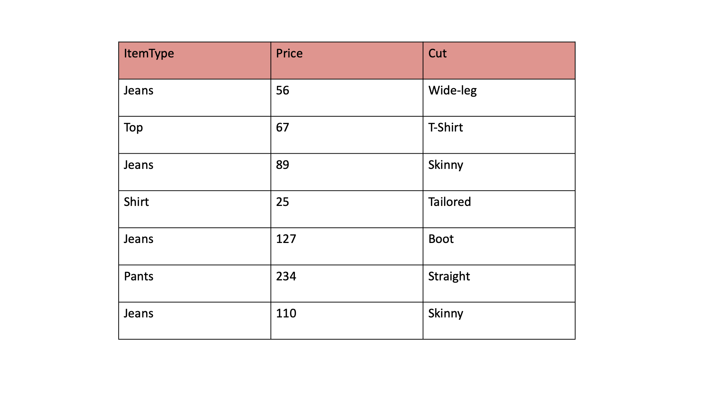

Indexing in R ist ein wichtiges Konzept, das es uns ermöglicht, auf bestimmte Elemente oder Teilmengen von Daten in Vektoren, Matrizen und Datenrahmen zuzugreifen. 

In diesem Blog werden wir die Indexing anhand von Beispielen für jede dieser Datenstrukturen (i.e., Objekte) behandeln.

Um unser Leben zu erleichtern und den Inhalt dieses Blogs verständlicher zu machen, werden wir ein alltägliches Beispiel verwenden. Das Beispiel basiert auf einem Datensatz (keine Sorge, es ist ein erfundener, den ich zum Zwecke dieses Blogs erstellt habe), der eine Liste von Kleidungsstücken enthält. Hier konzentrieren wir uns auf Jeans, die verschiedene Attribute aufweisen, über die wir indexieren können.


In unserem Kleider-Datensatz können wir die "perfekte" Jeans suchen. Dafür wereden wir Indexierungsmethoden in R verwenden, um unsere Suche zu verfeinern und genau das zu finden, ohne jeden Eintrag einzeln durchsehen zu müssen.

Durch die Verwendung von Indexierungsoperationen können wir beispielsweise alle Jeans einer bestimmten Preis herausfiltern. 

Wir könnten auch komplexere Abfragen durchführen, wie das Suchen aller Jeans, die weniger als 50 Euro kosten.

Im Verlauf dieses Blogs werden wir sehen, wie solche Indexierungen in R effizient durchgeführt werden können, sodass Sie die volle Kontrolle über Ihre Daten und deren Abfragen haben. 


## Bonus 

Zusätzlich, als Bonus und um zu veranschaulichen, wie wir vom Filtern und Indexieren zur Visualisierung übergehen, werden wir auch die Funktion hist() verwenden, um eine Histogramm-Grafik zu erstellen. 

Dies wird nicht nur unser Datenverständnis vertiefen, sondern uns auch ermöglichen, unsere Daten zusammenzufassen und visuell darzustellen.

Ein Histogramm ist eine großartige Möglichkeit, die Verteilung der Daten zu zeigen. Beispielsweise könnten wir ein Histogramm der Jeanspreise erstellen, um zu sehen, wie viele Jeans in verschiedene Preiskategorien fallen. 

Dies kann besonders hilfreich sein, **um Muster in unseren Daten schnell zu erkennen**, wie etwa das Vorherrschen bestimmter Preisbereiche oder das Erkennen, ob es Ausreißer gibt.

Indem wir die hist() Funktion auf unseren gefilterten Datensatz anwenden – zum Beispiel, nachdem wir alle Jeans einer bestimmten Marke ausgewählt haben – können wir die Verteilung der Attribute wie Preis oder Größe innerhalb dieser Auswahl betrachten. Dies bietet einen direkten Einblick in die Charakteristiken unserer Daten und unterstützt uns dabei, bessere Entscheidungen und Analysen zu treffen.


## Indexing a Vector:
In R ist ein Vektor ein eindimensionales Array von Datenelementen (e.g., x = 3). Sie können einen Vektor 'indizieren', um auf bestimmte Elemente zuzugreifen, indem Sie eckige Klammern [] verwenden. Die Indexierung von Vektoren beginnt bei 1 (In anderen Programmiersprachen beginnt die 'Indexing' bei 0).

Here's how to index a vector:


```{r}
# Create a vector
my_vector = c(10, 20, 30, 40, 50)

# Access the first element
element_1 = my_vector[1]
print(element_1)  # Output: 10

# Access the third element
element_3 = my_vector[3]
print(element_3)  # Output: 30

```


Du kannst auch vektorisierte Indexing verwenden, um auf mehrere Elemente gleichzeitig zuzugreifen:

```{r}
# Access the first three elements
elements_1_to_3 = my_vector[1:3]
print(elements_1_to_3)  # Output: 10 20 30
```


## Indexing a Matrix:

Eine Matrix ist ein zweidimensionales Array mit Zeilen und Spalten. 

Du kannst Elemente einer Matrix 'indizieren', indem du die eckige Klammern mit Zeilen- und Spaltenindizes verwendest, die durch ein Komma getrennt sind.


</img>

So indizierst du eine Matrix:

```{r}
# Create a matrix
my_matrix = matrix(1:9, nrow = 3, ncol = 3)

# Access the element in the second row and third column
element_2_3 = my_matrix[2, 3]
print(element_2_3)  # Output: 6
```


So 'indizierst' du eine Matrix:

```{r}
# Access the second row
row_2 = my_matrix[2, ]
print(row_2)  # Output: 4 5 6

# Access the first column
col_1 = my_matrix[, 1]
print(col_1)  # Output: 1 2 3

```


## Indexing a DataFrame:
Ein Data Frame ist eine zweidimensionale Datenstruktur in R, ähnlich wie eine Tabelle in einer Datenbank oder ein Excel Spreadsheet.  

Du kannst ein Data Frame mit eckigen Klammern 'indizieren' und dabei die Zeilen- und Spaltennamen oder -indizes angeben.

So wird ein Data Frame 'indiziert':

```{r}
# Create a data frame
my_dataframe = data.frame(
  ItemType = rep(c("jeans"), 100),
  Price = round(rnorm(100, 60, 20), digits = 0),
  Cut = rep(c("boot", "7/8", "skinny", "wide leg", "boyfriend"), 120)
)

# get a glimpse of the data
head(my_dataframe)

# Access the second row
row_2 = my_dataframe[2, ]
print(row_2)


# Access the entire first column
col_2 = my_dataframe[ ,2]
col_2[1:50]


# Access the 'Age' column using column name
allCuts = my_dataframe$Cut
allCuts[1:20]  # Output: 25 30 22

# get the type of the Item Type 
typeof(allCuts)

# get the categories within Item Type
levels(allCuts) # returns NUll....why?

# turn the variable into factor 
my_dataframe$Cut = factor(my_dataframe$Cut)


# get the categories within Item Type
levels(my_dataframe$Cut)
```


# Indexing by condition
Angenommen, du hast einen Data Frame namens 'my_dataframe' wie folgt:

```{r}
condition_boot = my_dataframe$Cut == "boot"

my_dataframe_boot = my_dataframe[condition_boot,]

#get a glimpse of the new dataframe using the head(). Use the ? mark to learn about the function head (or any other function)
head(my_dataframe_boot, n = 20) # n stands for the number of top observations you wish to see out of the dataframe 


# bonus...lets see the distribution of the prices of boot cuts 
hist(my_dataframe[condition_boot, 2],
      col = "lightblue", border = "#227FCE",
     main = paste("Histogram of Boot-Cut Jeans"),
     xlab = "prices of wide-leg jeans")
```

### and a bonus filtering task

```{r}
# bonus...lets see the distribution of the prices of wide leg cuts looks similar....
condition_wide = my_dataframe$Cut == "wide leg"

hist(my_dataframe[condition_wide, 2],
     col = "lightblue", border = "black",
     main = paste("Histogram of Wide-leg Jeans"),
     xlab = "prices of wide-leg jeans"
     )
```

## Indexing/Filtering by multiple conditions 

Stellen wir uns vor, wir wollen Zeilen für alle "Wide leg" Jeans extrahieren UND die mehr als 39 EUR kosten. Hier ist ein Beispiel, wie du den Datenrahmen einrichten und die Operation durchführen könntest:

Wir können mehrerer Bedingungen kombinieren mithilfe von logischen Operatoren wie & (UND) und | (ODER). 

Zum Beispiel, 

(1) wenn du Zeilen filtern möchtest, in denen 'price' größer als 39 UND ein "wide leg" cut ist.


```{r}
# condition that will select both wide cuts and those that cost more than 59Euro
condition_wide_39 = my_dataframe$Cut == "wide leg" & my_dataframe$Price > 39
head(condition_wide_39)

data_wide_39 = my_dataframe[condition_wide_39,]

hist(data_wide_39[,2],
     col = "lightblue", border = "#227FCE",
     main = paste("Histogram of > 39Euros & Wide-leg Cut"),
     xlab = "prices of 'wide-leg & price > 39' jeans"
     )
```


(2) wenn du Zeilen filtern möchtest, in denen 'price' größer als 39 ODER ein "wide leg" cut ist.

```{r}
# condition that will select both wide cuts and those that cost more than 59Euro
condition_wide_or_39 = my_dataframe$Cut == "wide leg" | my_dataframe$Price > 39
head(condition_wide_or_39)

data_wide_or_39 = my_dataframe[condition_wide_or_39,]

hist(data_wide_or_39[,2],
     col = "lightblue", border = "#227FCE",
     main = paste("Histogram of > 39Euros & Wide-leg Cut"),
     xlab = "prices of 'wide-leg & price > 39' jeans"
     )
```


---


#### Important to know: 
In R, the '$' sign is used to access a specific column (variable) within a data frame or list. It allows you to extract or work with a single column of data from a larger data structure, such as a data frame, without having to reference the entire data frame each time.

**Task 1: Access a Specific Element in a Matrix/Dataframe**

<div style = "border: 1px solid;margin: auto;width: 90%;padding: 10px;text-align:left;background:#DBF9FC;font-family: curier;font-size:15px">


2. Use indexing to access and display the element in the second row and third column in the dataframe presented earlier in this blogpost.

3. Print the value of the accessed element.

</div>

```{r, echo=FALSE, results='hide'}
# Access the element in the second row and third column
element = my_dataframe[2, 3]
print(element)

```

**Task 2: Extend and index a Matrix/Dataframe**

<div style = "border: 1px solid;margin: auto;width: 90%;padding: 10px;text-align:left;background:#DBF9FC;font-family: curier;font-size:15px">

1. Add another column to the dataframe, which represents the brand category. It will be the following vector: rep(c("expensive","top", "middle", "affordable", "cheap"), 120). *learn about that rep() does by typing ?rep in the console!

2. Use indexing to extract and display the first 10 rows of this dataframe and see if the rep() did what it was suppose to.

</div>


```{r, echo=FALSE, results='hide'}
# Extend the dataframe
my_dataframe$Brand = rep(c("expensive","top", "middle", "affordable", "cheap"), 120)

# Extract the entire second row
dataframe_first10rows = my_dataframe[1:10, ]
print(dataframe_first10rows)
```

**Task 3: Extract rows in Matrix/Dataframe by condition**

<div style = "border: 1px solid;margin: auto;width: 90%;padding: 10px;text-align:left;background:#DBF9FC;font-family: curier;font-size:15px">

1. Extract the rows in the dataframe, which represents only the "affordable" category.

2. Print it.

3. Bonus: create a histogram to show the distribution of the prices in this category
</div>


```{r, echo=FALSE, results='hide'}
# Define condition
condition_brandCategory = my_dataframe$Brand == "affordable"

# filter according to this condition
filtered_cat = my_dataframe[condition_brandCategory,]

# print the filtered dataset
print(filtered_cat)

# create a histogram
hist(filtered_cat$Price)
```

**Task 4: Filter by multiple conditions**

<div style = "border: 1px solid;margin: auto;width: 90%;padding: 10px;text-align:left;background:#DBF9FC;font-family: curier;font-size:15px">

1. Extract the rows in the dataframe, which represents only the "cheap" category and where prices are below 30.

2. Print it.

3. Bonus: create a histogram to show the distribution of the prices in these two conditions. 

</div>

```{r, echo=FALSE, results='hide'}
# Define condition
condition_brand_price = my_dataframe$Brand == "affordable" & my_dataframe$Price < 30

# filter according to this condition
filtered_ctgs = my_dataframe[condition_brand_price,]

# print the filtered dataset
print(filtered_ctgs)

# create a histogram
hist(filtered_ctgs$Price)
```


**Task 5: Add a column and index**

<div style = "border: 1px solid;margin: auto;width: 90%;padding: 10px;text-align:left;background:#DBF9FC;font-family: curier;font-size:15px">

1. Extend the my_dataframe data frame with a new column named 'ID'. Use the '$' to do so. Hin: we have 600 rows in this dataframe. Use dim() to find our what the dimensions of this dataframe is to knwo how many rows we have.  

2. Use indexing to access and display the first 100 rows.

3. Print your results.
</div>


```{r, echo=FALSE, results='hide'}
# Extend the data frame with 'item ID' column
my_dataframe$ID <- c(1:600)

# take a plimse of the data with the head() function

head(my_dataframe)

# Select only the ID 1-100
id_1_100 <- my_dataframe[1:100, ]
id_1_100 <- my_dataframe[1:100, ]

print(id_1_100)
```

